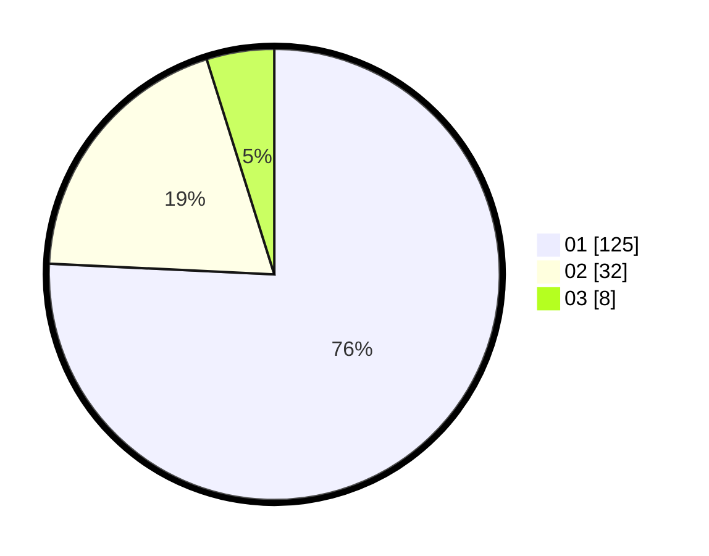

# Hasil

Hasil perolehan suara paslon dapat dilihat pada file paslon-01.txt, paslon-02.txt, dan paslon-03.txt.

Jika tidak ada, artinya data tersebut belum ada pada SIREKAP.

## Perolehan Suara

 * Paslon 01: **125**.
 * Paslon 02: **32**.
 * Paslon 03: **8**.

## Foto C Plano

https://sirekap-obj-formc.kpu.go.id/f2bb/pemilu/ppwp/31/72/03/10/06/3172031006047-20240214-193816--8eb34817-120f-4cb9-9f68-7e375515e03d.jpg

https://sirekap-obj-formc.kpu.go.id/f2bb/pemilu/ppwp/31/72/03/10/06/3172031006047-20240214-200753--bb5b12b0-1a1e-43ba-a413-763c11866ebd.jpg

https://sirekap-obj-formc.kpu.go.id/f2bb/pemilu/ppwp/31/72/03/10/06/3172031006047-20240214-210953--b8888769-95c3-437f-a40e-a1935cf75c7a.jpg

## DATA PEMILIH TETAP

Jumlah pemilih dalam DPT: **292**.
 * L: **153**.
 * P: **139**.

## DATA PENGGUNA HAK PILIH

Jumlah pengguna hak pilih dalam DPT: **163**.
 * L: **79**.
 * P: **84**.

Jumlah pengguna hak pilih dalam DPTb: **2**.
 * L: **2**.
 * P: **0**.

Jumlah pengguna hak pilih dalam DPK: **1**.
 * L: **1**.
 * P: **0**.

Jumlah pengguna hak pilih: **166**.
 * L: **82**.
 * P: **84**.

## JUMLAH SUARA SAH DAN TIDAK SAH

JUMLAH SELURUH SUARA SAH: **165**.

JUMLAH SUARA TIDAK SAH: **1**.

JUMLAH SELURUH SUARA SAH DAN SUARA TIDAK SAH: **166**.
