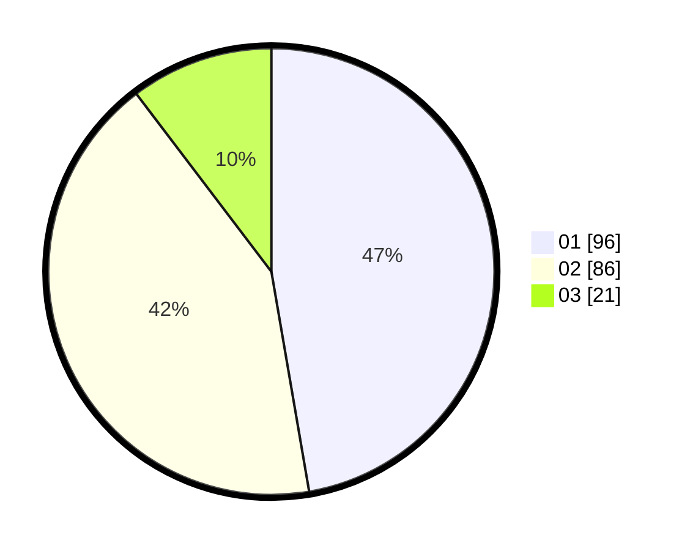

# Hasil

Hasil perolehan suara paslon dapat dilihat pada file paslon-01.txt, paslon-02.txt, dan paslon-03.txt.

Jika tidak ada, artinya data tersebut belum ada pada SIREKAP.

## Perolehan Suara

 * Paslon 01: **96**.
 * Paslon 02: **86**.
 * Paslon 03: **21**.

## Foto C Plano

https://sirekap-obj-formc.kpu.go.id/79cb/pemilu/ppwp/31/72/03/10/06/3172031006051-20240214-220449--f7f8ba47-6e2e-4213-b94c-558b02f01d49.jpg

https://sirekap-obj-formc.kpu.go.id/79cb/pemilu/ppwp/31/72/03/10/06/3172031006051-20240214-221955--bcba3810-a384-4897-98f1-470c71a62ba9.jpg

https://sirekap-obj-formc.kpu.go.id/79cb/pemilu/ppwp/31/72/03/10/06/3172031006051-20240214-222105--e9b64fd5-ca07-4127-a9db-1ee75a7e8725.jpg
