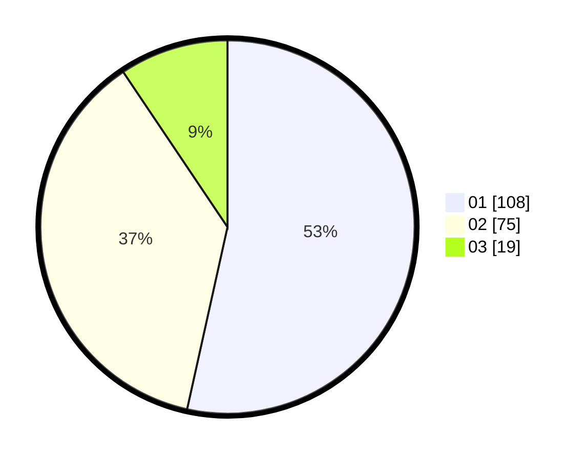

# Hasil

Hasil perolehan suara paslon dapat dilihat pada file paslon-01.txt, paslon-02.txt, dan paslon-03.txt.

Jika tidak ada, artinya data tersebut belum ada pada SIREKAP.

## Perolehan Suara

 * Paslon 01: **108**.
 * Paslon 02: **75**.
 * Paslon 03: **19**.

## Foto C Plano

https://sirekap-obj-formc.kpu.go.id/cb83/pemilu/ppwp/31/72/03/10/06/3172031006053-20240214-222135--b37eb4ec-5268-4390-82cf-6bf76991b269.jpg

https://sirekap-obj-formc.kpu.go.id/cb83/pemilu/ppwp/31/72/03/10/06/3172031006053-20240214-222208--ac51b646-96af-46f8-9c6a-593a77b4b7d0.jpg

https://sirekap-obj-formc.kpu.go.id/cb83/pemilu/ppwp/31/72/03/10/06/3172031006053-20240214-222227--6017e618-0f58-4c65-af67-a8d7a888e684.jpg
