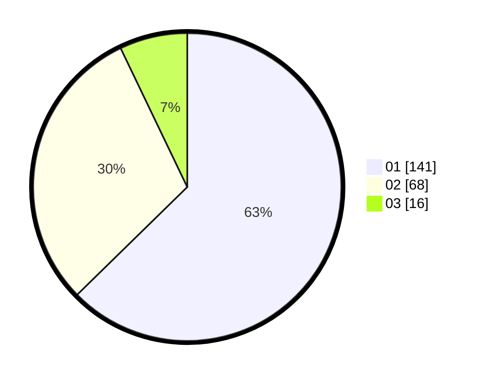

# Hasil

Hasil perolehan suara paslon dapat dilihat pada file paslon-01.txt, paslon-02.txt, dan paslon-03.txt.

Jika tidak ada, artinya data tersebut belum ada pada SIREKAP.

## Perolehan Suara

 * Paslon 01: **141**.
 * Paslon 02: **68**.
 * Paslon 03: **16**.

## Foto C Plano

https://sirekap-obj-formc.kpu.go.id/24bf/pemilu/ppwp/31/72/03/10/06/3172031006063-20240214-222021--46db4ec4-5e02-4024-ac67-a8d394e6910c.jpg

https://sirekap-obj-formc.kpu.go.id/24bf/pemilu/ppwp/31/72/03/10/06/3172031006063-20240214-222223--0a828d0f-c452-4f41-a9f8-531d56b4f012.jpg

https://sirekap-obj-formc.kpu.go.id/24bf/pemilu/ppwp/31/72/03/10/06/3172031006063-20240214-234512--63f4666e-acbb-4538-8af8-87d777abd1ae.jpg
