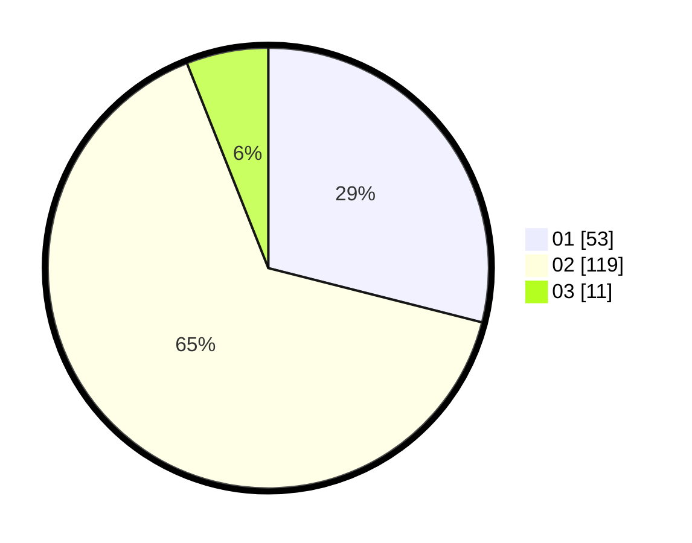

# Hasil

Hasil perolehan suara paslon dapat dilihat pada file paslon-01.txt, paslon-02.txt, dan paslon-03.txt.

Jika tidak ada, artinya data tersebut belum ada pada SIREKAP.

## Perolehan Suara

 * Paslon 01: **53**.
 * Paslon 02: **119**.
 * Paslon 03: **11**.

## Foto C Plano

https://sirekap-obj-formc.kpu.go.id/42d0/pemilu/ppwp/31/72/03/10/06/3172031006065-20240215-014833--257ff096-5a92-433b-a0a3-99ff7b0aa90c.jpg

https://sirekap-obj-formc.kpu.go.id/42d0/pemilu/ppwp/31/72/03/10/06/3172031006065-20240215-015756--e5de9011-7c71-4f4e-beaf-499e14ccbc33.jpg

https://sirekap-obj-formc.kpu.go.id/42d0/pemilu/ppwp/31/72/03/10/06/3172031006065-20240215-015932--087a9ec4-a95f-48d2-a666-89ab245dd6da.jpg
