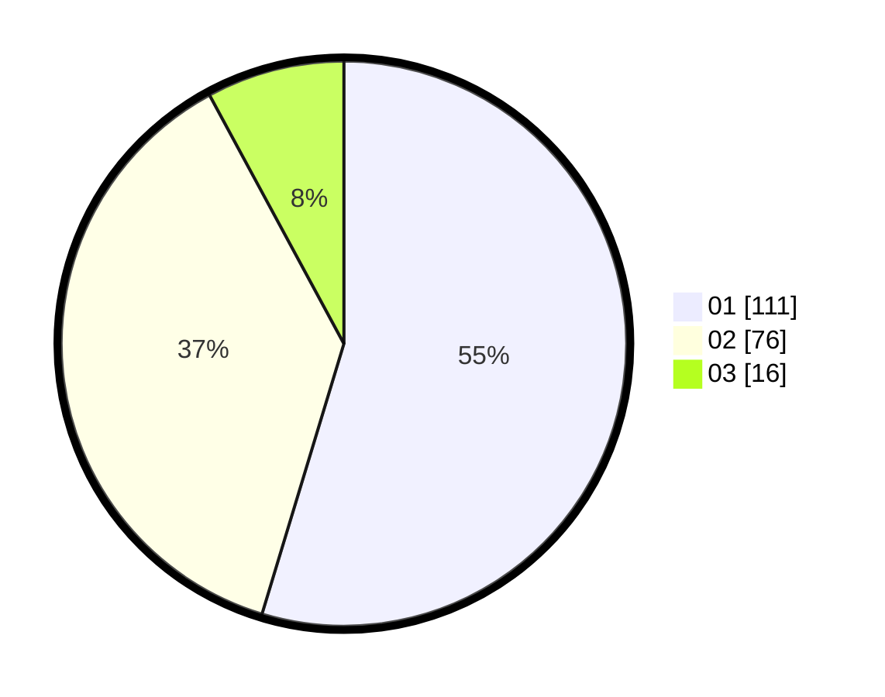

# Hasil

Hasil perolehan suara paslon dapat dilihat pada file paslon-01.txt, paslon-02.txt, dan paslon-03.txt.

Jika tidak ada, artinya data tersebut belum ada pada SIREKAP.

## Perolehan Suara

 * Paslon 01: **111**.
 * Paslon 02: **76**.
 * Paslon 03: **16**.

## Foto C Plano

https://sirekap-obj-formc.kpu.go.id/59f2/pemilu/ppwp/31/72/03/10/06/3172031006066-20240214-205732--50a5c502-1ae0-4306-8488-63e58b5cf60f.jpg

https://sirekap-obj-formc.kpu.go.id/59f2/pemilu/ppwp/31/72/03/10/06/3172031006066-20240214-200452--00a9ce4f-14a1-49f1-afdf-1e4fcdcb63a5.jpg

https://sirekap-obj-formc.kpu.go.id/59f2/pemilu/ppwp/31/72/03/10/06/3172031006066-20240214-200611--adc7990d-2715-4e58-a0fc-a874780c1976.jpg

## DATA PEMILIH TETAP

Jumlah pemilih dalam DPT: **262**.
 * L: **132**.
 * P: **130**.

## DATA PENGGUNA HAK PILIH

Jumlah pengguna hak pilih dalam DPT: **206**.
 * L: **100**.
 * P: **106**.

Jumlah pengguna hak pilih dalam DPTb: **1**.
 * L: **0**.
 * P: **1**.

Jumlah pengguna hak pilih dalam DPK: **0**.
 * L: **0**.
 * P: **0**.

Jumlah pengguna hak pilih: **207**.
 * L: **100**.
 * P: **107**.

## JUMLAH SUARA SAH DAN TIDAK SAH

JUMLAH SELURUH SUARA SAH: **203**.

JUMLAH SUARA TIDAK SAH: **4**.

JUMLAH SELURUH SUARA SAH DAN SUARA TIDAK SAH: **207**.
