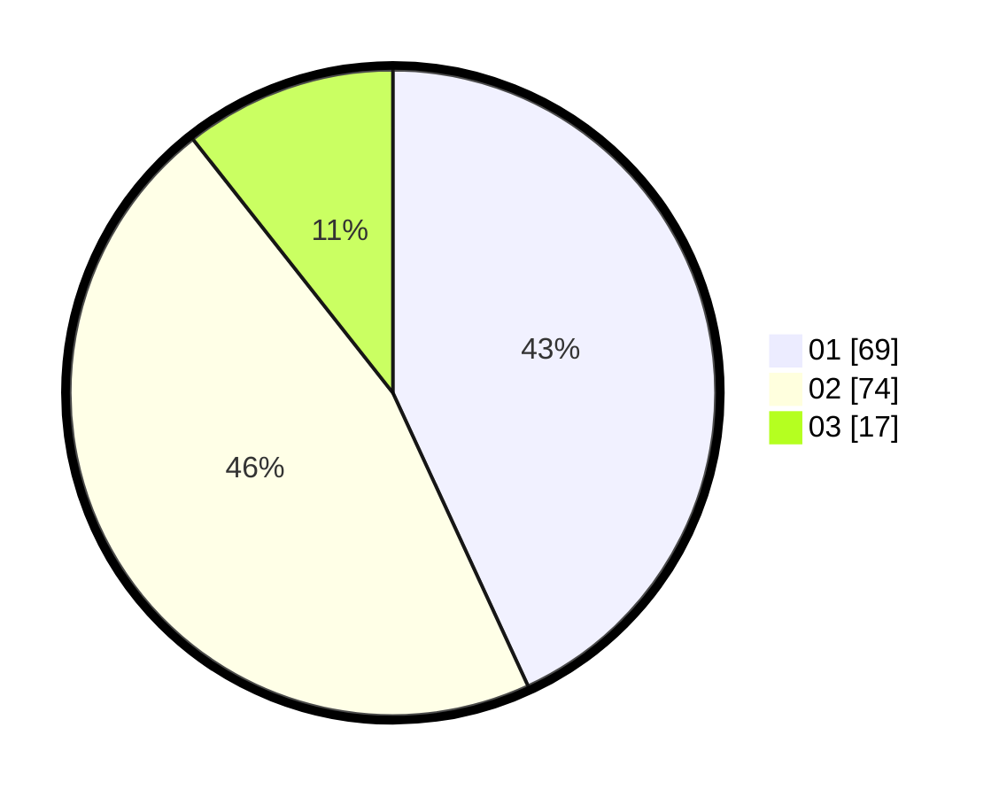

# Hasil

Hasil perolehan suara paslon dapat dilihat pada file paslon-01.txt, paslon-02.txt, dan paslon-03.txt.

Jika tidak ada, artinya data tersebut belum ada pada SIREKAP.

## Perolehan Suara

 * Paslon 01: **69**.
 * Paslon 02: **74**.
 * Paslon 03: **17**.

## Foto C Plano

https://sirekap-obj-formc.kpu.go.id/f57b/pemilu/ppwp/31/72/03/10/06/3172031006068-20240215-002645--da8b0635-b974-444e-b2af-7d455a445910.jpg

https://sirekap-obj-formc.kpu.go.id/f57b/pemilu/ppwp/31/72/03/10/06/3172031006068-20240215-002830--64ce7b15-fd11-48ed-8bef-c6a039acedd9.jpg

https://sirekap-obj-formc.kpu.go.id/f57b/pemilu/ppwp/31/72/03/10/06/3172031006068-20240215-002853--4f044dd6-2b92-4812-83f3-370af4f29dd7.jpg
