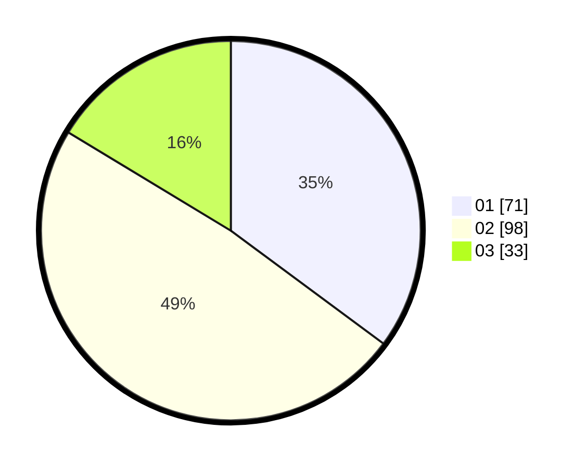

# Hasil

Hasil perolehan suara paslon dapat dilihat pada file paslon-01.txt, paslon-02.txt, dan paslon-03.txt.

Jika tidak ada, artinya data tersebut belum ada pada SIREKAP.

## Perolehan Suara

 * Paslon 01: **71**.
 * Paslon 02: **98**.
 * Paslon 03: **33**.

## Foto C Plano

https://sirekap-obj-formc.kpu.go.id/5fa8/pemilu/ppwp/31/72/03/10/06/3172031006074-20240214-193746--63118cdc-ff5e-4914-8386-0b558a27a142.jpg

https://sirekap-obj-formc.kpu.go.id/5fa8/pemilu/ppwp/31/72/03/10/06/3172031006074-20240215-093908--e684a01f-8731-4407-8f61-692383e9d11b.jpg

https://sirekap-obj-formc.kpu.go.id/5fa8/pemilu/ppwp/31/72/03/10/06/3172031006074-20240215-093914--db80cbbe-653e-41d3-93d4-9a7bcb4dc7bc.jpg

## DATA PEMILIH TETAP

Jumlah pemilih dalam DPT: **267**.
 * L: **129**.
 * P: **138**.

## DATA PENGGUNA HAK PILIH

Jumlah pengguna hak pilih dalam DPT: **197**.
 * L: **95**.
 * P: **102**.

Jumlah pengguna hak pilih dalam DPTb: **1**.
 * L: **0**.
 * P: **1**.

Jumlah pengguna hak pilih dalam DPK: **5**.
 * L: **2**.
 * P: **3**.

Jumlah pengguna hak pilih: **203**.
 * L: **97**.
 * P: **106**.

## JUMLAH SUARA SAH DAN TIDAK SAH

JUMLAH SELURUH SUARA SAH: **202**.

JUMLAH SUARA TIDAK SAH: **1**.

JUMLAH SELURUH SUARA SAH DAN SUARA TIDAK SAH: **203**.
