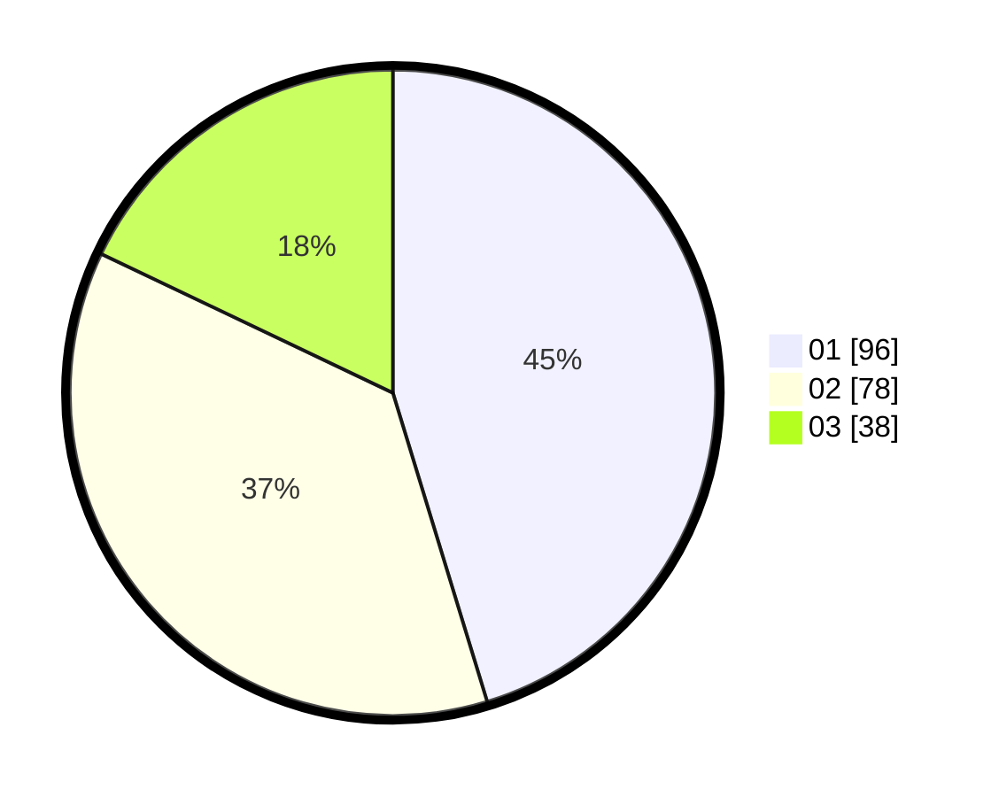

# Hasil

Hasil perolehan suara paslon dapat dilihat pada file paslon-01.txt, paslon-02.txt, dan paslon-03.txt.

Jika tidak ada, artinya data tersebut belum ada pada SIREKAP.

## Perolehan Suara

 * Paslon 01: **96**.
 * Paslon 02: **78**.
 * Paslon 03: **38**.

## Foto C Plano

https://sirekap-obj-formc.kpu.go.id/d773/pemilu/ppwp/31/72/03/10/06/3172031006076-20240214-191509--a142a6bb-e677-4dba-9794-30cd718821a2.jpg

https://sirekap-obj-formc.kpu.go.id/d773/pemilu/ppwp/31/72/03/10/06/3172031006076-20240214-191600--a3f29fdd-e47c-4ac5-a527-d6672c547809.jpg

https://sirekap-obj-formc.kpu.go.id/d773/pemilu/ppwp/31/72/03/10/06/3172031006076-20240214-191302--a26c3dcc-416e-4d81-8d02-3b8525c0e966.jpg

## DATA PEMILIH TETAP

Jumlah pemilih dalam DPT: **293**.
 * L: **143**.
 * P: **150**.

## DATA PENGGUNA HAK PILIH

Jumlah pengguna hak pilih dalam DPT: **216**.
 * L: **102**.
 * P: **114**.

Jumlah pengguna hak pilih dalam DPTb: **0**.
 * L: **0**.
 * P: **0**.

Jumlah pengguna hak pilih dalam DPK: **1**.
 * L: **1**.
 * P: **0**.

Jumlah pengguna hak pilih: **217**.
 * L: **103**.
 * P: **114**.

## JUMLAH SUARA SAH DAN TIDAK SAH

JUMLAH SELURUH SUARA SAH: **212**.

JUMLAH SUARA TIDAK SAH: **5**.

JUMLAH SELURUH SUARA SAH DAN SUARA TIDAK SAH: **217**.
