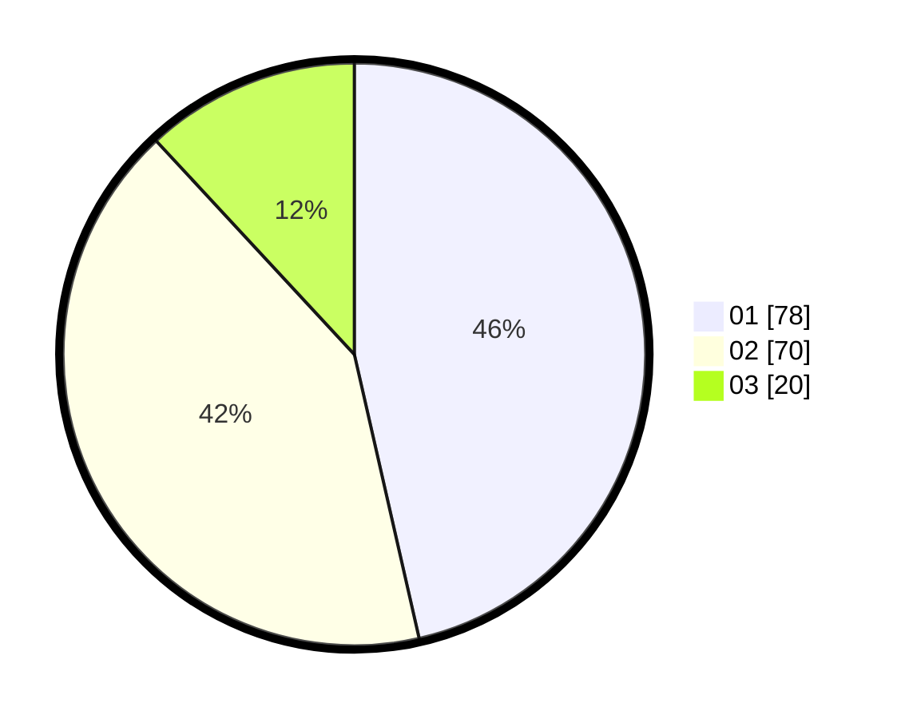

# Hasil

Hasil perolehan suara paslon dapat dilihat pada file paslon-01.txt, paslon-02.txt, dan paslon-03.txt.

Jika tidak ada, artinya data tersebut belum ada pada SIREKAP.

## Perolehan Suara

 * Paslon 01: **78**.
 * Paslon 02: **70**.
 * Paslon 03: **20**.

## Foto C Plano

https://sirekap-obj-formc.kpu.go.id/bde4/pemilu/ppwp/31/72/03/10/06/3172031006077-20240215-015713--21ee09d1-c925-44ab-96d3-8e91aa569aa7.jpg

https://sirekap-obj-formc.kpu.go.id/bde4/pemilu/ppwp/31/72/03/10/06/3172031006077-20240215-015911--34b0afc7-05b5-4710-b3f6-0e7f1b044bf4.jpg

https://sirekap-obj-formc.kpu.go.id/bde4/pemilu/ppwp/31/72/03/10/06/3172031006077-20240215-020009--c538e95f-e9cd-4f3a-867d-6c5c86301ddf.jpg

## DATA PEMILIH TETAP

Jumlah pemilih dalam DPT: **271**.
 * L: **136**.
 * P: **135**.

## DATA PENGGUNA HAK PILIH

Jumlah pengguna hak pilih dalam DPT: **165**.
 * L: **78**.
 * P: **87**.

Jumlah pengguna hak pilih dalam DPTb: **2**.
 * L: **1**.
 * P: **1**.

Jumlah pengguna hak pilih dalam DPK: **4**.
 * L: **2**.
 * P: **2**.

Jumlah pengguna hak pilih: **171**.
 * L: **81**.
 * P: **90**.

## JUMLAH SUARA SAH DAN TIDAK SAH

JUMLAH SELURUH SUARA SAH: **168**.

JUMLAH SUARA TIDAK SAH: **3**.

JUMLAH SELURUH SUARA SAH DAN SUARA TIDAK SAH: **171**.
