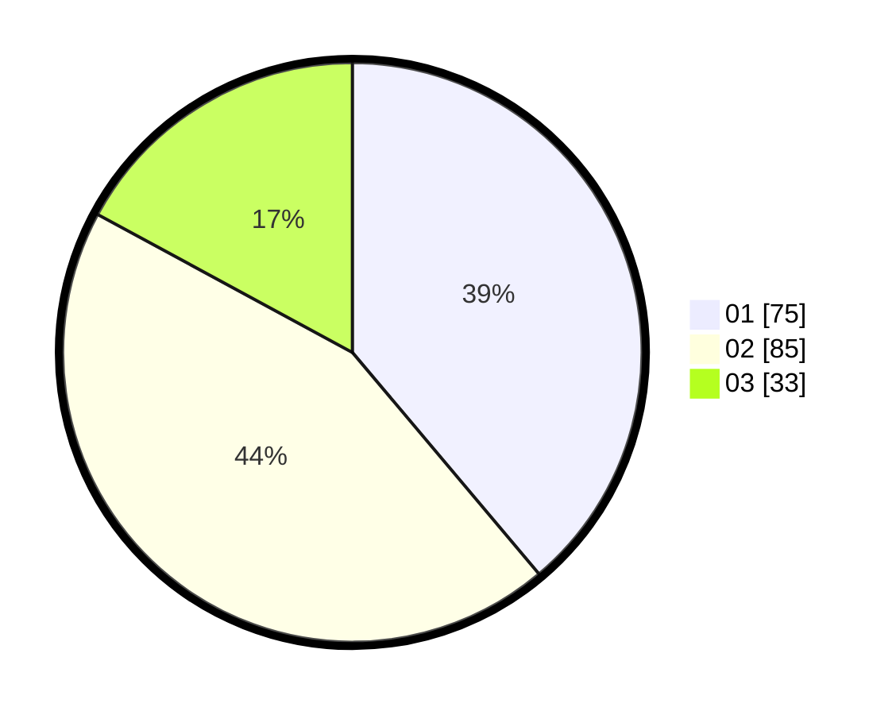

# Hasil

Hasil perolehan suara paslon dapat dilihat pada file paslon-01.txt, paslon-02.txt, dan paslon-03.txt.

Jika tidak ada, artinya data tersebut belum ada pada SIREKAP.

## Perolehan Suara

 * Paslon 01: **75**.
 * Paslon 02: **85**.
 * Paslon 03: **33**.

## Foto C Plano

https://sirekap-obj-formc.kpu.go.id/ffce/pemilu/ppwp/31/72/03/10/06/3172031006078-20240215-013916--49b8c7ad-0053-4044-9575-781ae2b49cfc.jpg

https://sirekap-obj-formc.kpu.go.id/ffce/pemilu/ppwp/31/72/03/10/06/3172031006078-20240215-014604--febe3097-cc2b-4e5e-b6e4-ba4231ffcadc.jpg

https://sirekap-obj-formc.kpu.go.id/ffce/pemilu/ppwp/31/72/03/10/06/3172031006078-20240215-014752--705f223d-a6c0-41f5-94c0-fc7599e6cee2.jpg
