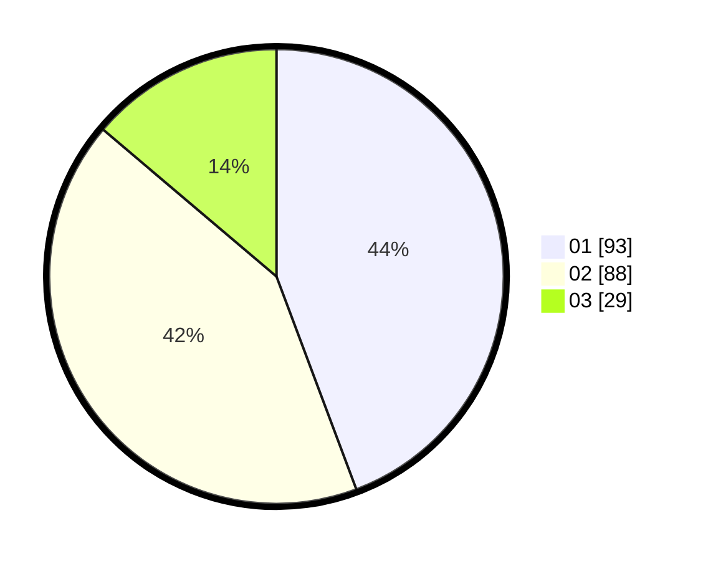

# Hasil

Hasil perolehan suara paslon dapat dilihat pada file paslon-01.txt, paslon-02.txt, dan paslon-03.txt.

Jika tidak ada, artinya data tersebut belum ada pada SIREKAP.

## Perolehan Suara

 * Paslon 01: **93**.
 * Paslon 02: **88**.
 * Paslon 03: **29**.

## Foto C Plano

https://sirekap-obj-formc.kpu.go.id/5aae/pemilu/ppwp/31/72/03/10/06/3172031006079-20240215-024008--78d7659d-665c-4338-a3ef-27f86858ab5e.jpg

https://sirekap-obj-formc.kpu.go.id/5aae/pemilu/ppwp/31/72/03/10/06/3172031006079-20240215-024116--0ca4f18e-6511-4dd4-980e-25bcf37e8c04.jpg

https://sirekap-obj-formc.kpu.go.id/5aae/pemilu/ppwp/31/72/03/10/06/3172031006079-20240215-024152--07630954-eb3f-4642-b79c-2d56708a4625.jpg
