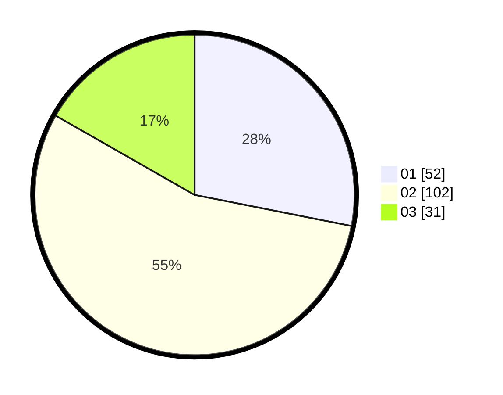

# Hasil

Hasil perolehan suara paslon dapat dilihat pada file paslon-01.txt, paslon-02.txt, dan paslon-03.txt.

Jika tidak ada, artinya data tersebut belum ada pada SIREKAP.

## Perolehan Suara

 * Paslon 01: **52**.
 * Paslon 02: **102**.
 * Paslon 03: **31**.

## Foto C Plano

https://sirekap-obj-formc.kpu.go.id/5309/pemilu/ppwp/31/72/03/10/06/3172031006080-20240215-012153--d3bea88f-efe4-4dff-9939-49350e56c25b.jpg

https://sirekap-obj-formc.kpu.go.id/5309/pemilu/ppwp/31/72/03/10/06/3172031006080-20240215-012254--393db437-60db-44a5-88f4-4697b3d749d5.jpg

https://sirekap-obj-formc.kpu.go.id/5309/pemilu/ppwp/31/72/03/10/06/3172031006080-20240215-012345--040e3772-d34e-4d32-8494-edfc3a4488db.jpg
