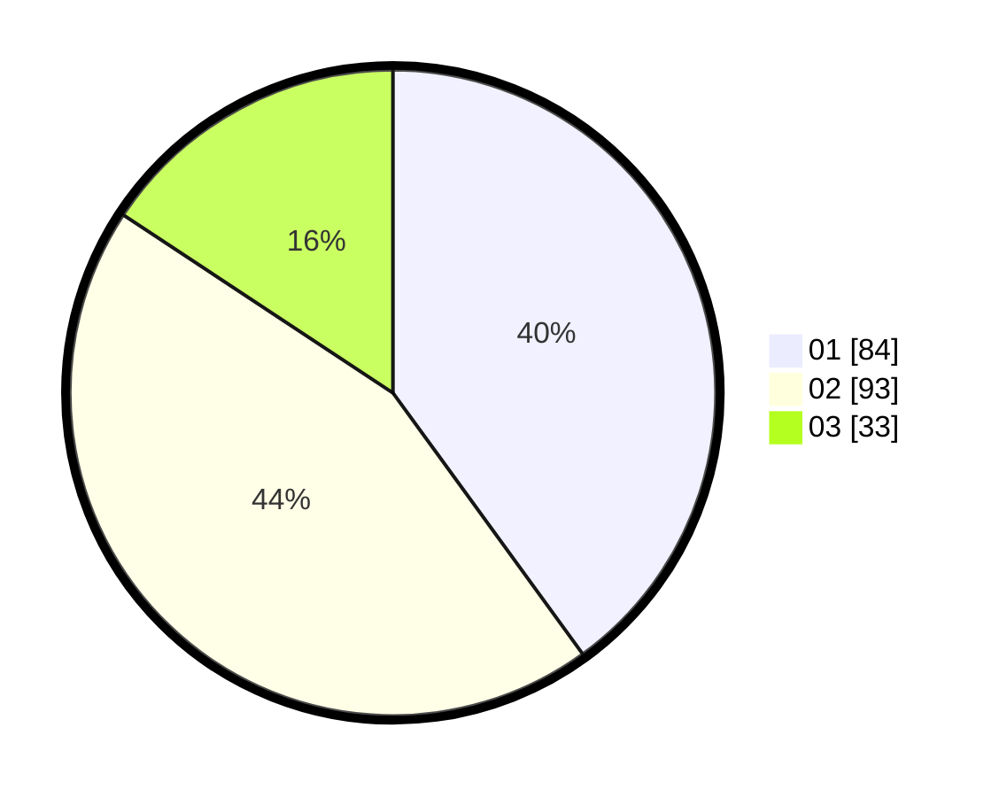

# Hasil

Hasil perolehan suara paslon dapat dilihat pada file paslon-01.txt, paslon-02.txt, dan paslon-03.txt.

Jika tidak ada, artinya data tersebut belum ada pada SIREKAP.

## Perolehan Suara

 * Paslon 01: **84**.
 * Paslon 02: **93**.
 * Paslon 03: **33**.

## Foto C Plano

https://sirekap-obj-formc.kpu.go.id/6dd9/pemilu/ppwp/31/72/03/10/06/3172031006088-20240215-143643--c6065204-948a-45fe-b3c9-e6cf8ac9a0bb.jpg

https://sirekap-obj-formc.kpu.go.id/6dd9/pemilu/ppwp/31/72/03/10/06/3172031006088-20240215-143706--fac72c80-cae0-4b98-89fe-af73a3ea772d.jpg

https://sirekap-obj-formc.kpu.go.id/6dd9/pemilu/ppwp/31/72/03/10/06/3172031006088-20240215-143654--30d24e39-2321-476b-87f8-555ada8fba76.jpg

## DATA PEMILIH TETAP

Jumlah pemilih dalam DPT: **292**.
 * L: **145**.
 * P: **147**.

## DATA PENGGUNA HAK PILIH

Jumlah pengguna hak pilih dalam DPT: **211**.
 * L: **97**.
 * P: **114**.

Jumlah pengguna hak pilih dalam DPTb: **2**.
 * L: **2**.
 * P: **0**.

Jumlah pengguna hak pilih dalam DPK: **0**.
 * L: **0**.
 * P: **0**.

Jumlah pengguna hak pilih: **213**.
 * L: **99**.
 * P: **114**.

## JUMLAH SUARA SAH DAN TIDAK SAH

JUMLAH SELURUH SUARA SAH: **210**.

JUMLAH SUARA TIDAK SAH: **3**.

JUMLAH SELURUH SUARA SAH DAN SUARA TIDAK SAH: **213**.
