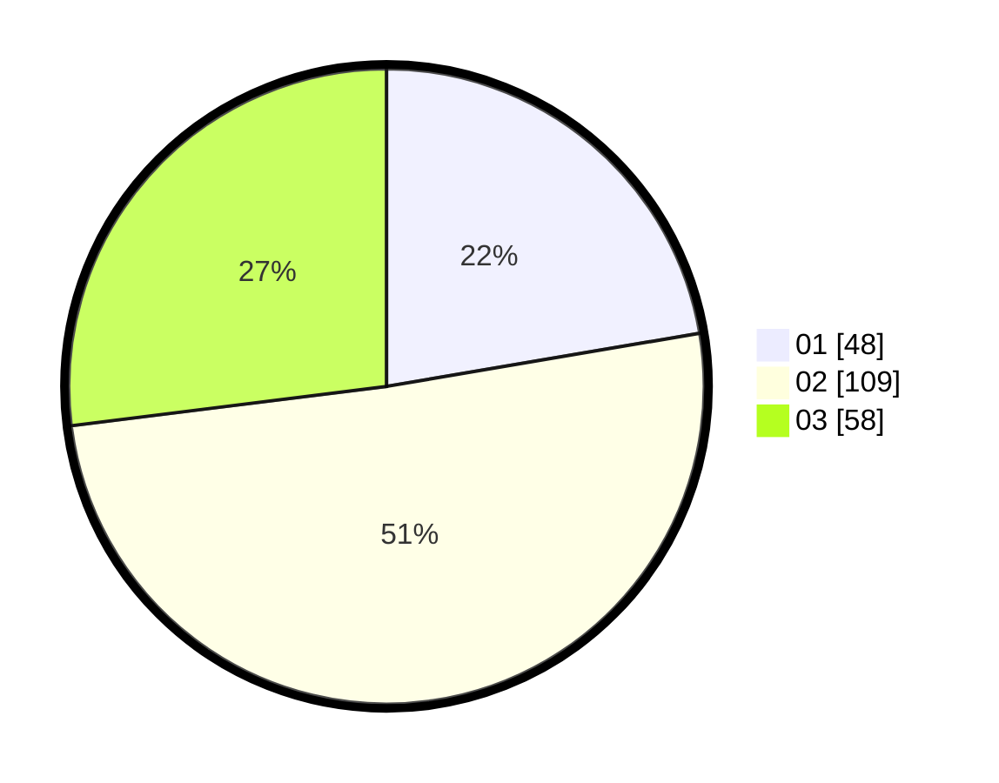

# Hasil

Hasil perolehan suara paslon dapat dilihat pada file paslon-01.txt, paslon-02.txt, dan paslon-03.txt.

Jika tidak ada, artinya data tersebut belum ada pada SIREKAP.

## Perolehan Suara

 * Paslon 01: **48**.
 * Paslon 02: **109**.
 * Paslon 03: **58**.

## Foto C Plano

https://sirekap-obj-formc.kpu.go.id/187c/pemilu/ppwp/31/72/03/10/06/3172031006099-20240214-194601--b258c87d-0dfc-4aeb-9190-15fad6f8df95.jpg

https://sirekap-obj-formc.kpu.go.id/187c/pemilu/ppwp/31/72/03/10/06/3172031006099-20240215-010226--7e833bec-123e-4a07-a890-d69f1faf2545.jpg

https://sirekap-obj-formc.kpu.go.id/187c/pemilu/ppwp/31/72/03/10/06/3172031006099-20240214-195417--3edf4612-64ee-4369-966d-f28f2aa6d9ae.jpg

## DATA PEMILIH TETAP

Jumlah pemilih dalam DPT: **297**.
 * L: **141**.
 * P: **156**.

## DATA PENGGUNA HAK PILIH

Jumlah pengguna hak pilih dalam DPT: **197**.
 * L: **89**.
 * P: **108**.

Jumlah pengguna hak pilih dalam DPTb: **13**.
 * L: **11**.
 * P: **2**.

Jumlah pengguna hak pilih dalam DPK: **5**.
 * L: **4**.
 * P: **1**.

Jumlah pengguna hak pilih: **215**.
 * L: **104**.
 * P: **111**.

## JUMLAH SUARA SAH DAN TIDAK SAH

JUMLAH SELURUH SUARA SAH: **215**.

JUMLAH SUARA TIDAK SAH: **0**.

JUMLAH SELURUH SUARA SAH DAN SUARA TIDAK SAH: **215**.
