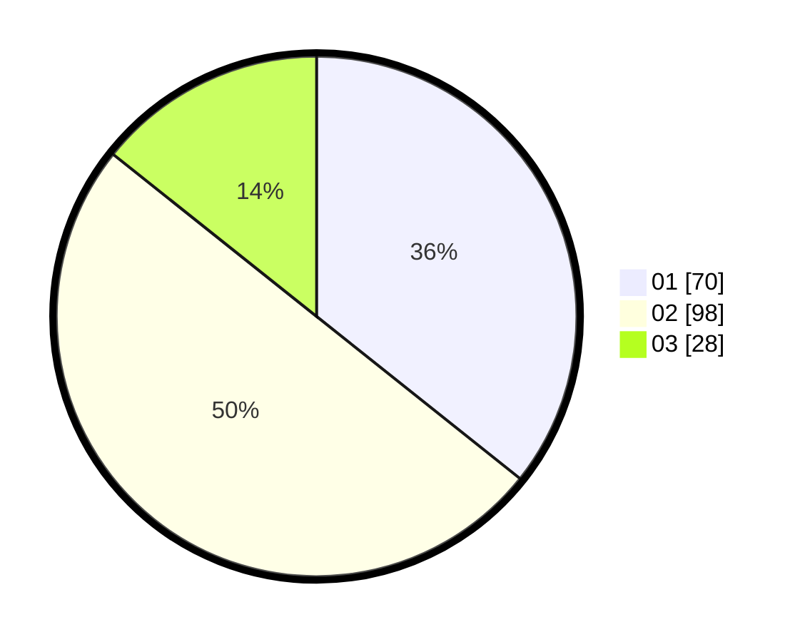

# Hasil

Hasil perolehan suara paslon dapat dilihat pada file paslon-01.txt, paslon-02.txt, dan paslon-03.txt.

Jika tidak ada, artinya data tersebut belum ada pada SIREKAP.

## Perolehan Suara

 * Paslon 01: **70**.
 * Paslon 02: **98**.
 * Paslon 03: **28**.

## Foto C Plano

https://sirekap-obj-formc.kpu.go.id/f089/pemilu/ppwp/31/72/03/10/06/3172031006100-20240214-211320--afde358d-0e06-4090-8c38-9456a268d841.jpg

https://sirekap-obj-formc.kpu.go.id/f089/pemilu/ppwp/31/72/03/10/06/3172031006100-20240214-211523--572a318e-9f81-4cb0-ba49-98b099b5dcac.jpg

https://sirekap-obj-formc.kpu.go.id/f089/pemilu/ppwp/31/72/03/10/06/3172031006100-20240214-211650--7319609e-cda5-418e-8a9c-72ebf73c3a6e.jpg

## DATA PEMILIH TETAP

Jumlah pemilih dalam DPT: **296**.
 * L: **143**.
 * P: **153**.

## DATA PENGGUNA HAK PILIH

Jumlah pengguna hak pilih dalam DPT: **189**.
 * L: **85**.
 * P: **104**.

Jumlah pengguna hak pilih dalam DPTb: **9**.
 * L: **5**.
 * P: **4**.

Jumlah pengguna hak pilih dalam DPK: **3**.
 * L: **3**.
 * P: **0**.

Jumlah pengguna hak pilih: **201**.
 * L: **93**.
 * P: **108**.

## JUMLAH SUARA SAH DAN TIDAK SAH

JUMLAH SELURUH SUARA SAH: **196**.

JUMLAH SUARA TIDAK SAH: **5**.

JUMLAH SELURUH SUARA SAH DAN SUARA TIDAK SAH: **201**.
