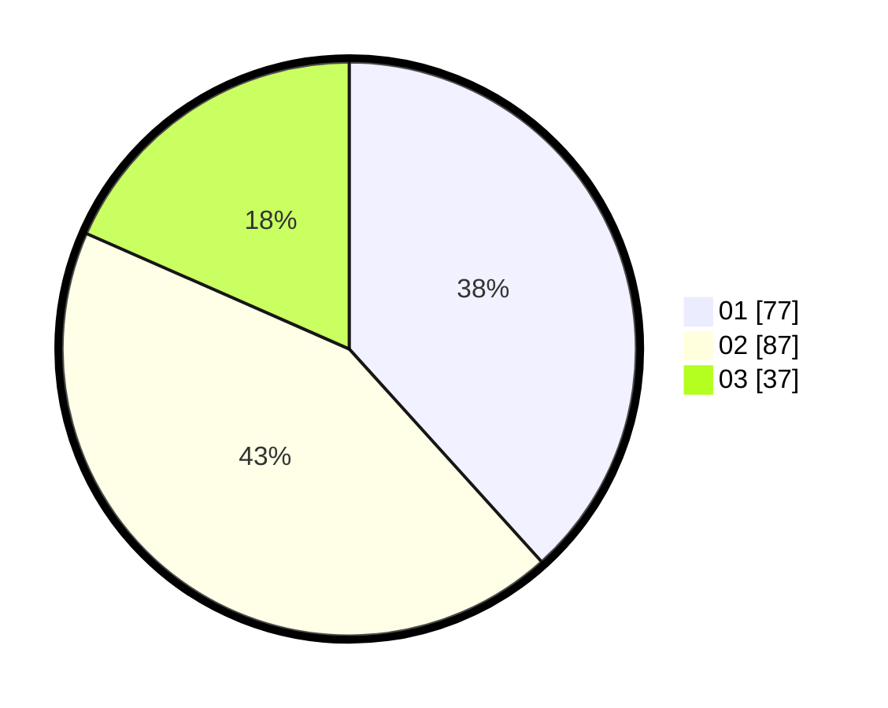

# Hasil

Hasil perolehan suara paslon dapat dilihat pada file paslon-01.txt, paslon-02.txt, dan paslon-03.txt.

Jika tidak ada, artinya data tersebut belum ada pada SIREKAP.

## Perolehan Suara

 * Paslon 01: **77**.
 * Paslon 02: **87**.
 * Paslon 03: **37**.

## Foto C Plano

https://sirekap-obj-formc.kpu.go.id/4a0f/pemilu/ppwp/31/72/03/10/06/3172031006107-20240214-205332--10cf129e-8040-4753-bfbe-afab248f593f.jpg

https://sirekap-obj-formc.kpu.go.id/4a0f/pemilu/ppwp/31/72/03/10/06/3172031006107-20240214-155732--ecfea400-bd9e-45c2-afbe-9bb317c31511.jpg

https://sirekap-obj-formc.kpu.go.id/4a0f/pemilu/ppwp/31/72/03/10/06/3172031006107-20240214-155819--3fb0ce64-c75e-4c9f-b94b-f4c1ae9e3baa.jpg
