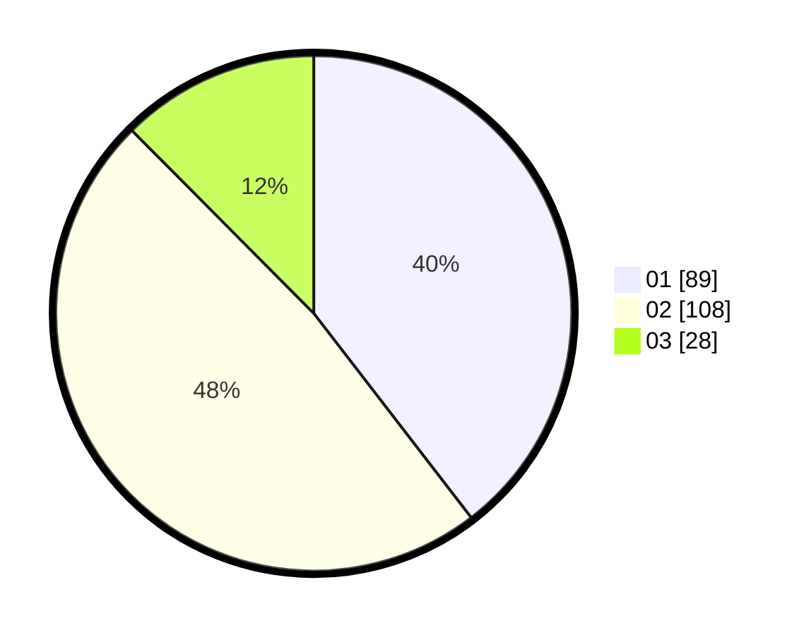

# Hasil

Hasil perolehan suara paslon dapat dilihat pada file paslon-01.txt, paslon-02.txt, dan paslon-03.txt.

Jika tidak ada, artinya data tersebut belum ada pada SIREKAP.

## Perolehan Suara

 * Paslon 01: **89**.
 * Paslon 02: **108**.
 * Paslon 03: **28**.

## Foto C Plano

https://sirekap-obj-formc.kpu.go.id/be3e/pemilu/ppwp/31/72/03/10/06/3172031006112-20240214-215124--21d1560e-c4ef-4a40-8cce-ba9d668e8b71.jpg

https://sirekap-obj-formc.kpu.go.id/be3e/pemilu/ppwp/31/72/03/10/06/3172031006112-20240214-215343--199ddf07-391c-45f8-9a56-4a31921d264a.jpg

https://sirekap-obj-formc.kpu.go.id/be3e/pemilu/ppwp/31/72/03/10/06/3172031006112-20240214-215520--d7a3d3f4-8c3d-4695-807a-90568c1112ee.jpg
