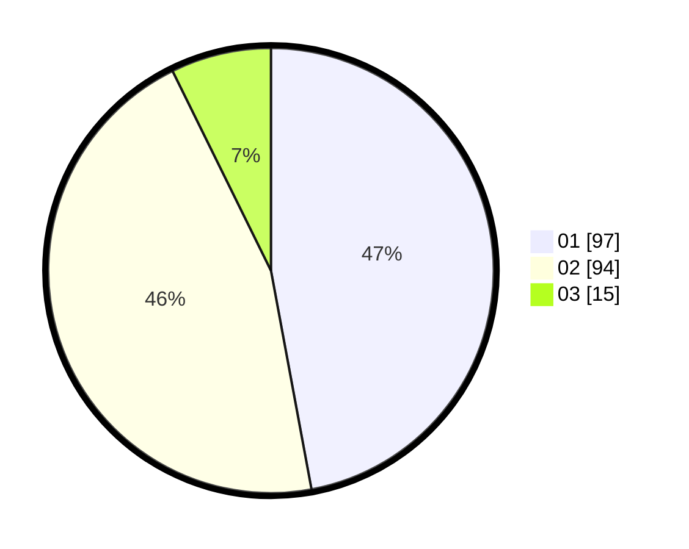

# Hasil

Hasil perolehan suara paslon dapat dilihat pada file paslon-01.txt, paslon-02.txt, dan paslon-03.txt.

Jika tidak ada, artinya data tersebut belum ada pada SIREKAP.

## Perolehan Suara

 * Paslon 01: **97**.
 * Paslon 02: **94**.
 * Paslon 03: **15**.

## Foto C Plano

https://sirekap-obj-formc.kpu.go.id/dfc7/pemilu/ppwp/31/72/03/10/06/3172031006125-20240214-225450--a702fd84-f9c9-4387-af7c-13f518e79cd2.jpg

https://sirekap-obj-formc.kpu.go.id/dfc7/pemilu/ppwp/31/72/03/10/06/3172031006125-20240214-225705--5459539b-3887-432c-8338-f6e7d6c373b0.jpg

https://sirekap-obj-formc.kpu.go.id/dfc7/pemilu/ppwp/31/72/03/10/06/3172031006125-20240214-225812--373a3a22-56f3-45d2-bec7-69ddcf0c050d.jpg
