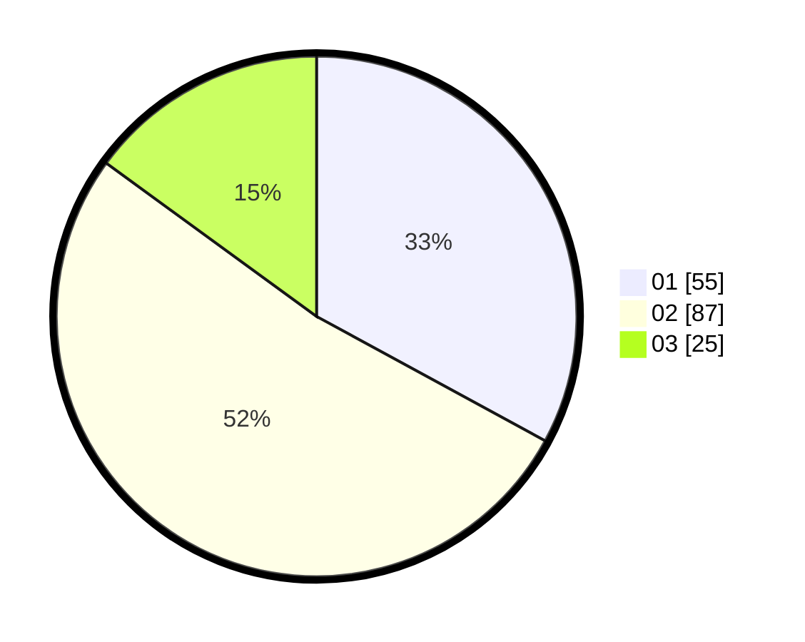

# Hasil

Hasil perolehan suara paslon dapat dilihat pada file paslon-01.txt, paslon-02.txt, dan paslon-03.txt.

Jika tidak ada, artinya data tersebut belum ada pada SIREKAP.

## Perolehan Suara

 * Paslon 01: **55**.
 * Paslon 02: **87**.
 * Paslon 03: **25**.

## Foto C Plano

https://sirekap-obj-formc.kpu.go.id/bf44/pemilu/ppwp/31/72/03/10/06/3172031006130-20240214-201239--b493fa29-4b43-450c-92f7-fc79ef77d5b1.jpg

https://sirekap-obj-formc.kpu.go.id/bf44/pemilu/ppwp/31/72/03/10/06/3172031006130-20240214-201444--c60d4dbe-7dd3-4ba0-93d6-c958be5afce9.jpg

https://sirekap-obj-formc.kpu.go.id/bf44/pemilu/ppwp/31/72/03/10/06/3172031006130-20240214-201552--d1aae69a-dd91-4803-8b96-6de3d95618c0.jpg
