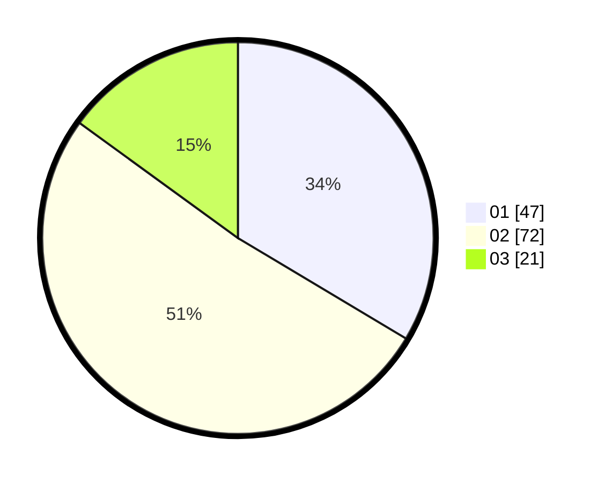

# Hasil

Hasil perolehan suara paslon dapat dilihat pada file paslon-01.txt, paslon-02.txt, dan paslon-03.txt.

Jika tidak ada, artinya data tersebut belum ada pada SIREKAP.

## Perolehan Suara

 * Paslon 01: **47**.
 * Paslon 02: **72**.
 * Paslon 03: **21**.

## Foto C Plano

https://sirekap-obj-formc.kpu.go.id/d4ae/pemilu/ppwp/31/72/03/10/06/3172031006134-20240216-131804--133c0c56-0572-4378-88c7-b3518bdba959.jpg

https://sirekap-obj-formc.kpu.go.id/d4ae/pemilu/ppwp/31/72/03/10/06/3172031006134-20240216-131819--c526b1b2-dcca-4c13-8c9f-ef089018c3c0.jpg

https://sirekap-obj-formc.kpu.go.id/d4ae/pemilu/ppwp/31/72/03/10/06/3172031006134-20240216-131833--c88b0bea-2eae-4333-815d-47a7cc320e34.jpg
