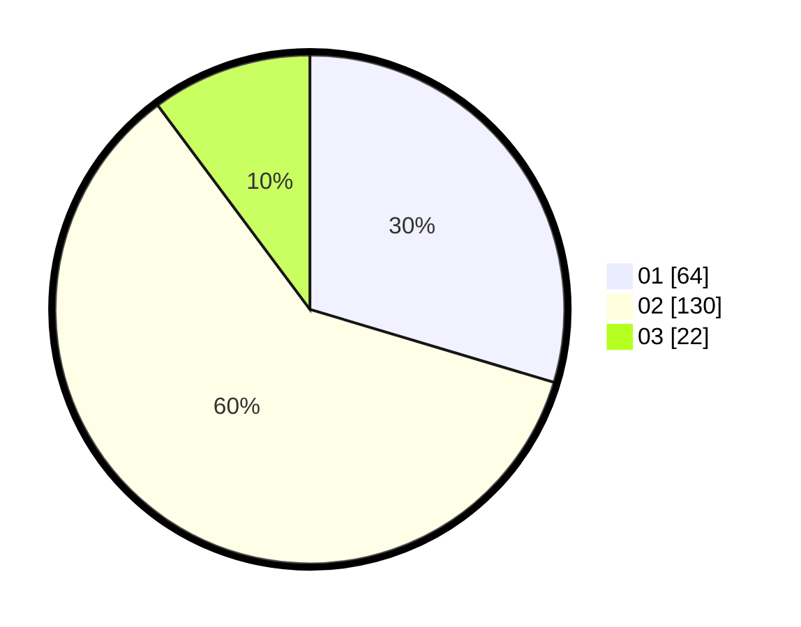

# Hasil

Hasil perolehan suara paslon dapat dilihat pada file paslon-01.txt, paslon-02.txt, dan paslon-03.txt.

Jika tidak ada, artinya data tersebut belum ada pada SIREKAP.

## Perolehan Suara

 * Paslon 01: **64**.
 * Paslon 02: **130**.
 * Paslon 03: **22**.

## Foto C Plano

https://sirekap-obj-formc.kpu.go.id/a9ad/pemilu/ppwp/31/72/03/10/06/3172031006135-20240214-192036--7b034866-38ed-4633-8173-84d61dbcb8da.jpg

https://sirekap-obj-formc.kpu.go.id/a9ad/pemilu/ppwp/31/72/03/10/06/3172031006135-20240214-194522--7bdf9738-4483-4642-a2a6-f54ea9a721da.jpg

https://sirekap-obj-formc.kpu.go.id/a9ad/pemilu/ppwp/31/72/03/10/06/3172031006135-20240214-194353--433b8630-44a6-4281-a28f-2d682b42f4ca.jpg

## DATA PEMILIH TETAP

Jumlah pemilih dalam DPT: **288**.
 * L: **137**.
 * P: **151**.

## DATA PENGGUNA HAK PILIH

Jumlah pengguna hak pilih dalam DPT: **220**.
 * L: **99**.
 * P: **121**.

Jumlah pengguna hak pilih dalam DPTb: **0**.
 * L: **0**.
 * P: **0**.

Jumlah pengguna hak pilih dalam DPK: **1**.
 * L: **1**.
 * P: **0**.

Jumlah pengguna hak pilih: **221**.
 * L: **100**.
 * P: **121**.

## JUMLAH SUARA SAH DAN TIDAK SAH

JUMLAH SELURUH SUARA SAH: **216**.

JUMLAH SUARA TIDAK SAH: **5**.

JUMLAH SELURUH SUARA SAH DAN SUARA TIDAK SAH: **221**.
