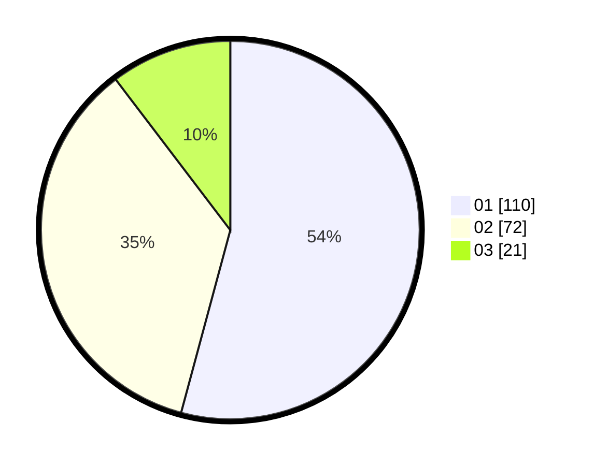

# Hasil

Hasil perolehan suara paslon dapat dilihat pada file paslon-01.txt, paslon-02.txt, dan paslon-03.txt.

Jika tidak ada, artinya data tersebut belum ada pada SIREKAP.

## Perolehan Suara

 * Paslon 01: **110**.
 * Paslon 02: **72**.
 * Paslon 03: **21**.

## Foto C Plano

https://sirekap-obj-formc.kpu.go.id/6d7a/pemilu/ppwp/31/72/04/10/01/3172041001001-20240214-232228--7c62bdfd-474b-4012-bf28-e2b69ab05094.jpg

https://sirekap-obj-formc.kpu.go.id/6d7a/pemilu/ppwp/31/72/04/10/01/3172041001001-20240214-232333--f8d79de9-506c-409b-bc77-cae9f2d1ef75.jpg

https://sirekap-obj-formc.kpu.go.id/6d7a/pemilu/ppwp/31/72/04/10/01/3172041001001-20240214-232530--8a439738-4e5b-4c72-9f0f-42d8765c4a57.jpg
