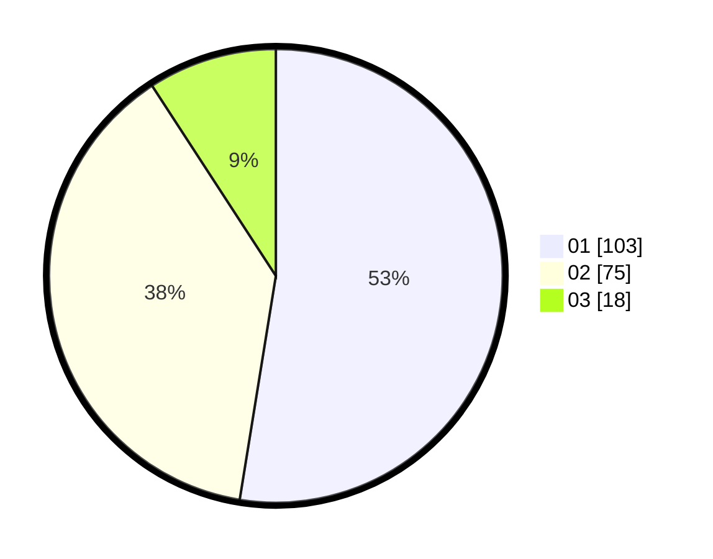

# Hasil

Hasil perolehan suara paslon dapat dilihat pada file paslon-01.txt, paslon-02.txt, dan paslon-03.txt.

Jika tidak ada, artinya data tersebut belum ada pada SIREKAP.

## Perolehan Suara

 * Paslon 01: **103**.
 * Paslon 02: **75**.
 * Paslon 03: **18**.

## Foto C Plano

https://sirekap-obj-formc.kpu.go.id/ad2d/pemilu/ppwp/31/72/04/10/01/3172041001012-20240216-202717--c839a749-574e-490c-be33-e2a745b4bb29.jpg

https://sirekap-obj-formc.kpu.go.id/ad2d/pemilu/ppwp/31/72/04/10/01/3172041001012-20240216-201740--feaa1fb1-921a-41fa-a579-fd48e9e66da4.jpg

https://sirekap-obj-formc.kpu.go.id/ad2d/pemilu/ppwp/31/72/04/10/01/3172041001012-20240216-202055--17a3ab36-d223-4244-bc68-daea6a418b71.jpg
