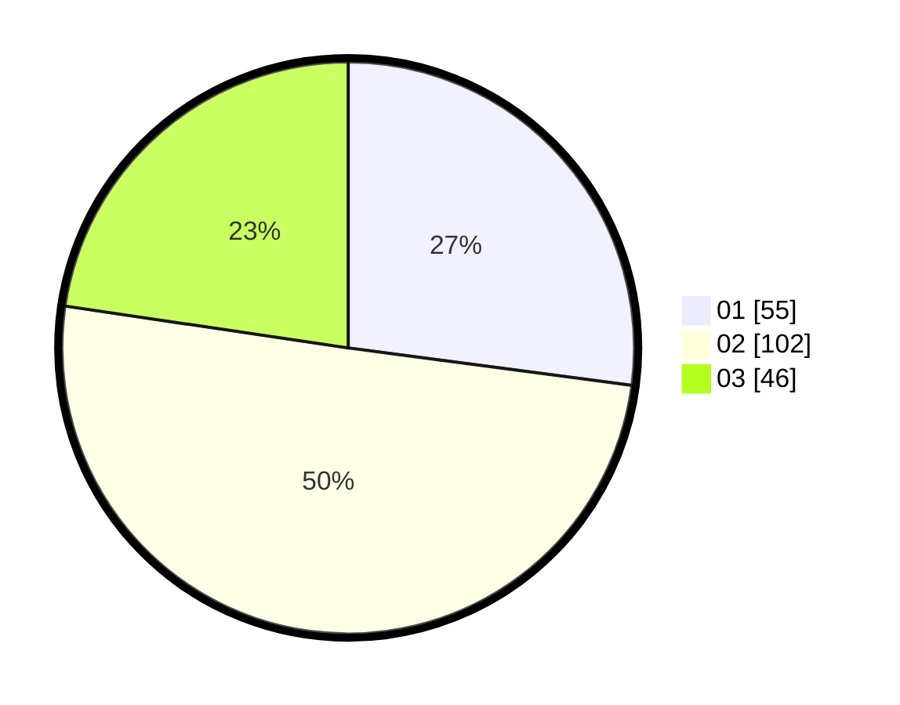

# Hasil

Hasil perolehan suara paslon dapat dilihat pada file paslon-01.txt, paslon-02.txt, dan paslon-03.txt.

Jika tidak ada, artinya data tersebut belum ada pada SIREKAP.

## Perolehan Suara

 * Paslon 01: **55**.
 * Paslon 02: **102**.
 * Paslon 03: **46**.

## Foto C Plano

https://sirekap-obj-formc.kpu.go.id/4a21/pemilu/ppwp/31/72/04/10/01/3172041001037-20240214-191826--1e8f6c50-8a9c-410f-a9b5-42d42a915399.jpg

https://sirekap-obj-formc.kpu.go.id/4a21/pemilu/ppwp/31/72/04/10/01/3172041001037-20240214-191716--c34cf008-a0d0-4ace-9249-f386afe735a4.jpg

https://sirekap-obj-formc.kpu.go.id/4a21/pemilu/ppwp/31/72/04/10/01/3172041001037-20240214-191921--12413407-1436-48aa-8534-e343a44e093e.jpg

## DATA PEMILIH TETAP

Jumlah pemilih dalam DPT: **291**.
 * L: **145**.
 * P: **146**.

## DATA PENGGUNA HAK PILIH

Jumlah pengguna hak pilih dalam DPT: **199**.
 * L: **95**.
 * P: **104**.

Jumlah pengguna hak pilih dalam DPTb: **0**.
 * L: **0**.
 * P: **0**.

Jumlah pengguna hak pilih dalam DPK: **9**.
 * L: **2**.
 * P: **7**.

Jumlah pengguna hak pilih: **208**.
 * L: **97**.
 * P: **111**.

## JUMLAH SUARA SAH DAN TIDAK SAH

JUMLAH SELURUH SUARA SAH: **203**.

JUMLAH SUARA TIDAK SAH: **5**.

JUMLAH SELURUH SUARA SAH DAN SUARA TIDAK SAH: **208**.
