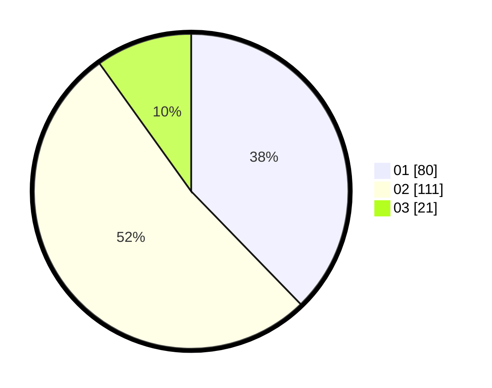

# Hasil

Hasil perolehan suara paslon dapat dilihat pada file paslon-01.txt, paslon-02.txt, dan paslon-03.txt.

Jika tidak ada, artinya data tersebut belum ada pada SIREKAP.

## Perolehan Suara

 * Paslon 01: **80**.
 * Paslon 02: **111**.
 * Paslon 03: **21**.

## Foto C Plano

https://sirekap-obj-formc.kpu.go.id/9f46/pemilu/ppwp/31/72/04/10/01/3172041001038-20240214-215906--de7ba5b9-15c3-483f-a655-34026abb9cfe.jpg

https://sirekap-obj-formc.kpu.go.id/9f46/pemilu/ppwp/31/72/04/10/01/3172041001038-20240214-193825--bc554281-404d-4056-b517-ddd9f7111a6a.jpg

https://sirekap-obj-formc.kpu.go.id/9f46/pemilu/ppwp/31/72/04/10/01/3172041001038-20240214-194521--5a53031f-0e44-4628-bc8a-4396e21f059e.jpg

## DATA PEMILIH TETAP

Jumlah pemilih dalam DPT: **294**.
 * L: **158**.
 * P: **136**.

## DATA PENGGUNA HAK PILIH

Jumlah pengguna hak pilih dalam DPT: **212**.
 * L: **111**.
 * P: **101**.

Jumlah pengguna hak pilih dalam DPTb: **0**.
 * L: **0**.
 * P: **0**.

Jumlah pengguna hak pilih dalam DPK: **2**.
 * L: **2**.
 * P: **0**.

Jumlah pengguna hak pilih: **214**.
 * L: **113**.
 * P: **101**.

## JUMLAH SUARA SAH DAN TIDAK SAH

JUMLAH SELURUH SUARA SAH: **0**.

JUMLAH SUARA TIDAK SAH: **2**.

JUMLAH SELURUH SUARA SAH DAN SUARA TIDAK SAH: **214**.
