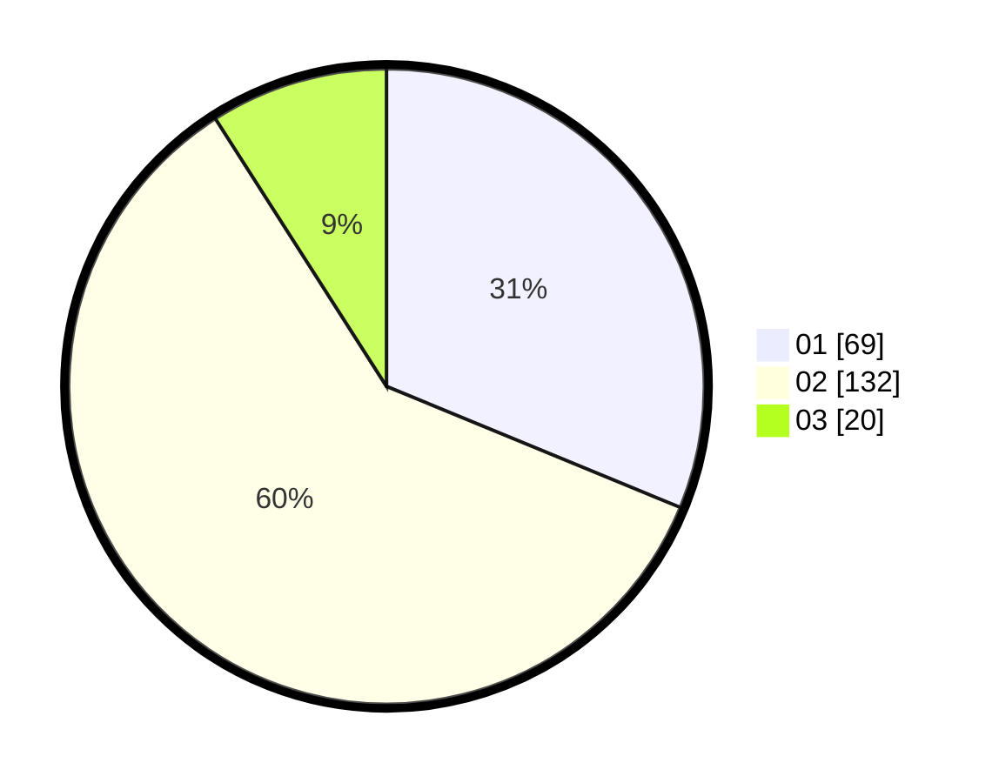

# Hasil

Hasil perolehan suara paslon dapat dilihat pada file paslon-01.txt, paslon-02.txt, dan paslon-03.txt.

Jika tidak ada, artinya data tersebut belum ada pada SIREKAP.

## Perolehan Suara

 * Paslon 01: **69**.
 * Paslon 02: **132**.
 * Paslon 03: **20**.

## Foto C Plano

https://sirekap-obj-formc.kpu.go.id/0b31/pemilu/ppwp/31/72/04/10/01/3172041001062-20240214-202401--35b712f6-3cf2-46ea-ac0d-74a3f68de3fa.jpg

https://sirekap-obj-formc.kpu.go.id/0b31/pemilu/ppwp/31/72/04/10/01/3172041001062-20240214-202513--ef71f9e7-f501-4047-b715-63f9fe59ed45.jpg

https://sirekap-obj-formc.kpu.go.id/0b31/pemilu/ppwp/31/72/04/10/01/3172041001062-20240214-202549--431e6959-870a-4a7c-9d39-2448c7a517dc.jpg

## DATA PEMILIH TETAP

Jumlah pemilih dalam DPT: **285**.
 * L: **139**.
 * P: **146**.

## DATA PENGGUNA HAK PILIH

Jumlah pengguna hak pilih dalam DPT: **226**.
 * L: **105**.
 * P: **121**.

Jumlah pengguna hak pilih dalam DPTb: **0**.
 * L: **0**.
 * P: **0**.

Jumlah pengguna hak pilih dalam DPK: **1**.
 * L: **0**.
 * P: **1**.

Jumlah pengguna hak pilih: **227**.
 * L: **105**.
 * P: **122**.

## JUMLAH SUARA SAH DAN TIDAK SAH

JUMLAH SELURUH SUARA SAH: **221**.

JUMLAH SUARA TIDAK SAH: **6**.

JUMLAH SELURUH SUARA SAH DAN SUARA TIDAK SAH: **227**.
