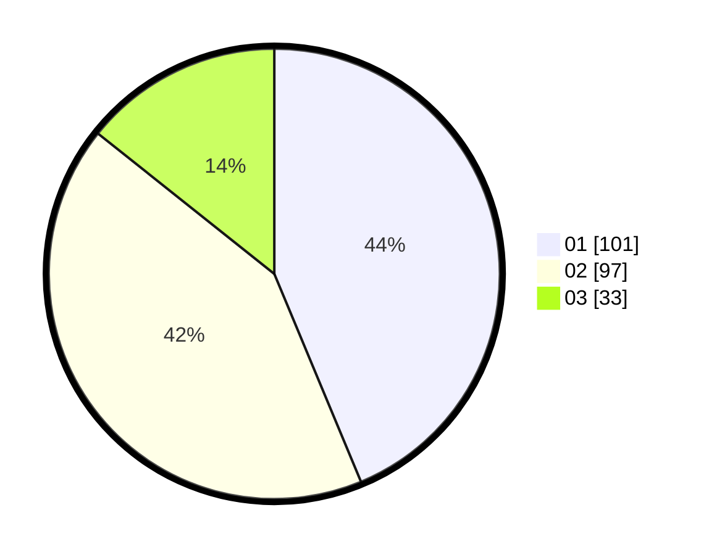

# Hasil

Hasil perolehan suara paslon dapat dilihat pada file paslon-01.txt, paslon-02.txt, dan paslon-03.txt.

Jika tidak ada, artinya data tersebut belum ada pada SIREKAP.

## Perolehan Suara

 * Paslon 01: **101**.
 * Paslon 02: **97**.
 * Paslon 03: **33**.

## Foto C Plano

https://sirekap-obj-formc.kpu.go.id/0b6c/pemilu/ppwp/31/72/04/10/01/3172041001081-20240214-155419--341d2ae3-0a20-4621-82a4-736d0598902b.jpg

https://sirekap-obj-formc.kpu.go.id/0b6c/pemilu/ppwp/31/72/04/10/01/3172041001081-20240214-155247--46cbcf53-3c5e-47f2-82c1-6a739fbf9ece.jpg

https://sirekap-obj-formc.kpu.go.id/0b6c/pemilu/ppwp/31/72/04/10/01/3172041001081-20240214-155603--ca4635e6-3a85-44ac-a363-f730197728d3.jpg

## DATA PEMILIH TETAP

Jumlah pemilih dalam DPT: **240**.
 * L: **135**.
 * P: **155**.

## DATA PENGGUNA HAK PILIH

Jumlah pengguna hak pilih dalam DPT: **205**.
 * L: **47**.
 * P: **120**.

Jumlah pengguna hak pilih dalam DPTb: **1**.
 * L: **4**.
 * P: **4**.

Jumlah pengguna hak pilih dalam DPK: **0**.
 * L: **0**.
 * P: **0**.

Jumlah pengguna hak pilih: **72**.
 * L: **107**.
 * P: **124**.

## JUMLAH SUARA SAH DAN TIDAK SAH

JUMLAH SELURUH SUARA SAH: **271**.

JUMLAH SUARA TIDAK SAH: **801**.

JUMLAH SELURUH SUARA SAH DAN SUARA TIDAK SAH: **72**.
