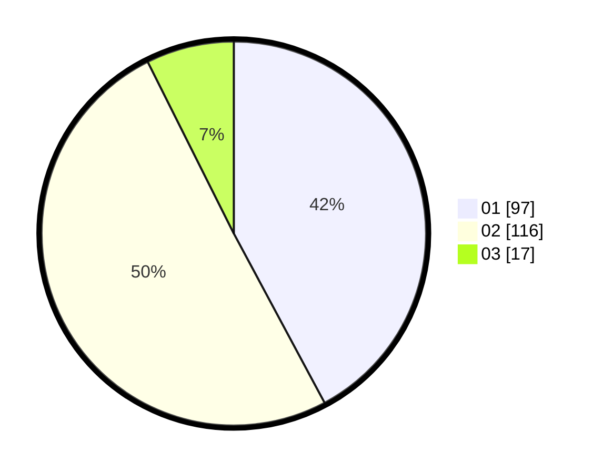

# Hasil

Hasil perolehan suara paslon dapat dilihat pada file paslon-01.txt, paslon-02.txt, dan paslon-03.txt.

Jika tidak ada, artinya data tersebut belum ada pada SIREKAP.

## Perolehan Suara

 * Paslon 01: **97**.
 * Paslon 02: **116**.
 * Paslon 03: **17**.

## Foto C Plano

https://sirekap-obj-formc.kpu.go.id/744b/pemilu/ppwp/31/72/04/10/01/3172041001119-20240214-205952--eb842f1a-e19c-4a7c-82ae-a07440707644.jpg

https://sirekap-obj-formc.kpu.go.id/744b/pemilu/ppwp/31/72/04/10/01/3172041001119-20240214-210838--f674e012-d309-4a49-b7d1-51c8cd66f4bc.jpg

https://sirekap-obj-formc.kpu.go.id/744b/pemilu/ppwp/31/72/04/10/01/3172041001119-20240214-221145--9bdae916-5bd3-44b2-bc10-15b82980cc56.jpg
