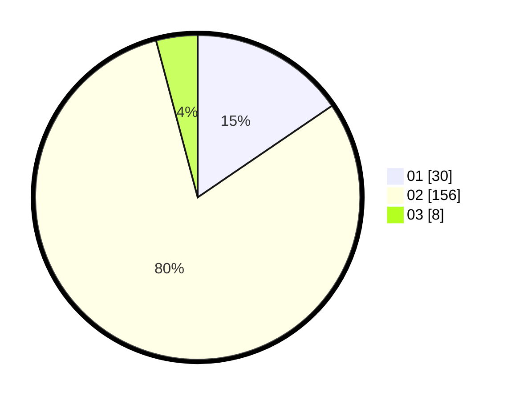

# Hasil

Hasil perolehan suara paslon dapat dilihat pada file paslon-01.txt, paslon-02.txt, dan paslon-03.txt.

Jika tidak ada, artinya data tersebut belum ada pada SIREKAP.

## Perolehan Suara

 * Paslon 01: **30**.
 * Paslon 02: **156**.
 * Paslon 03: **8**.

## Foto C Plano

https://sirekap-obj-formc.kpu.go.id/acb1/pemilu/ppwp/31/72/04/10/01/3172041001137-20240214-193515--506f7285-ad95-4f1b-bb3c-d5a1f2d3b523.jpg

https://sirekap-obj-formc.kpu.go.id/acb1/pemilu/ppwp/31/72/04/10/01/3172041001137-20240214-193621--5bee19e7-47d5-41c9-9771-6a9a9185f781.jpg

https://sirekap-obj-formc.kpu.go.id/acb1/pemilu/ppwp/31/72/04/10/01/3172041001137-20240214-193719--463813b6-8568-4818-a0eb-7604fddaf659.jpg

## DATA PEMILIH TETAP

Jumlah pemilih dalam DPT: **287**.
 * L: **162**.
 * P: **125**.

## DATA PENGGUNA HAK PILIH

Jumlah pengguna hak pilih dalam DPT: **199**.
 * L: **100**.
 * P: **99**.

Jumlah pengguna hak pilih dalam DPTb: **0**.
 * L: **0**.
 * P: **0**.

Jumlah pengguna hak pilih dalam DPK: **2**.
 * L: **1**.
 * P: **1**.

Jumlah pengguna hak pilih: **201**.
 * L: **101**.
 * P: **100**.

## JUMLAH SUARA SAH DAN TIDAK SAH

JUMLAH SELURUH SUARA SAH: **194**.

JUMLAH SUARA TIDAK SAH: **7**.

JUMLAH SELURUH SUARA SAH DAN SUARA TIDAK SAH: **201**.
