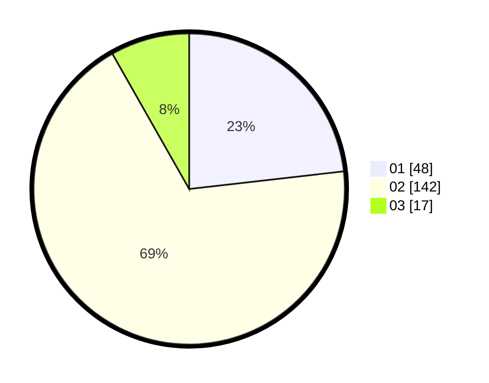

# Hasil

Hasil perolehan suara paslon dapat dilihat pada file paslon-01.txt, paslon-02.txt, dan paslon-03.txt.

Jika tidak ada, artinya data tersebut belum ada pada SIREKAP.

## Perolehan Suara

 * Paslon 01: **48**.
 * Paslon 02: **142**.
 * Paslon 03: **17**.

## Foto C Plano

https://sirekap-obj-formc.kpu.go.id/b128/pemilu/ppwp/31/72/04/10/01/3172041001138-20240216-212949--34fdc004-815f-4e2b-98dd-28d2e1f40853.jpg

https://sirekap-obj-formc.kpu.go.id/b128/pemilu/ppwp/31/72/04/10/01/3172041001138-20240214-210828--941a7b9a-e52d-40ea-8e3c-221f119e73f0.jpg

https://sirekap-obj-formc.kpu.go.id/b128/pemilu/ppwp/31/72/04/10/01/3172041001138-20240214-210938--cd23e9b3-b30b-48fc-9abc-d9dbf791df54.jpg
