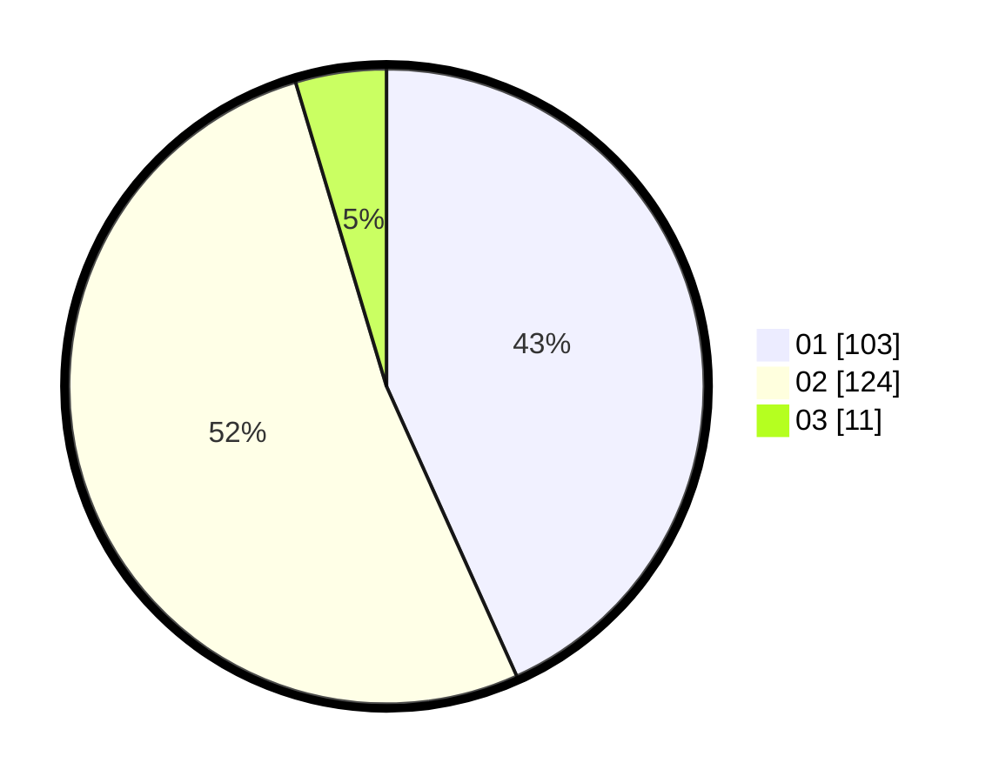

# Hasil

Hasil perolehan suara paslon dapat dilihat pada file paslon-01.txt, paslon-02.txt, dan paslon-03.txt.

Jika tidak ada, artinya data tersebut belum ada pada SIREKAP.

## Perolehan Suara

 * Paslon 01: **103**.
 * Paslon 02: **124**.
 * Paslon 03: **11**.

## Foto C Plano

https://sirekap-obj-formc.kpu.go.id/919d/pemilu/ppwp/31/72/04/10/01/3172041001144-20240214-225506--a096ccd5-0d65-4e9e-9862-7f387a2e1ce0.jpg

https://sirekap-obj-formc.kpu.go.id/919d/pemilu/ppwp/31/72/04/10/01/3172041001144-20240214-224911--416d42ec-58cf-4a64-8136-6adb09ad246f.jpg

https://sirekap-obj-formc.kpu.go.id/919d/pemilu/ppwp/31/72/04/10/01/3172041001144-20240214-225718--36bcf6ea-3d6f-4d89-9afb-a77953a7abbc.jpg

## DATA PEMILIH TETAP

Jumlah pemilih dalam DPT: **278**.
 * L: **135**.
 * P: **143**.

## DATA PENGGUNA HAK PILIH

Jumlah pengguna hak pilih dalam DPT: **226**.
 * L: **108**.
 * P: **118**.

Jumlah pengguna hak pilih dalam DPTb: **3**.
 * L: **2**.
 * P: **1**.

Jumlah pengguna hak pilih dalam DPK: **9**.
 * L: **4**.
 * P: **5**.

Jumlah pengguna hak pilih: **238**.
 * L: **114**.
 * P: **124**.

## JUMLAH SUARA SAH DAN TIDAK SAH

JUMLAH SELURUH SUARA SAH: **238**.

JUMLAH SUARA TIDAK SAH: **0**.

JUMLAH SELURUH SUARA SAH DAN SUARA TIDAK SAH: **238**.
