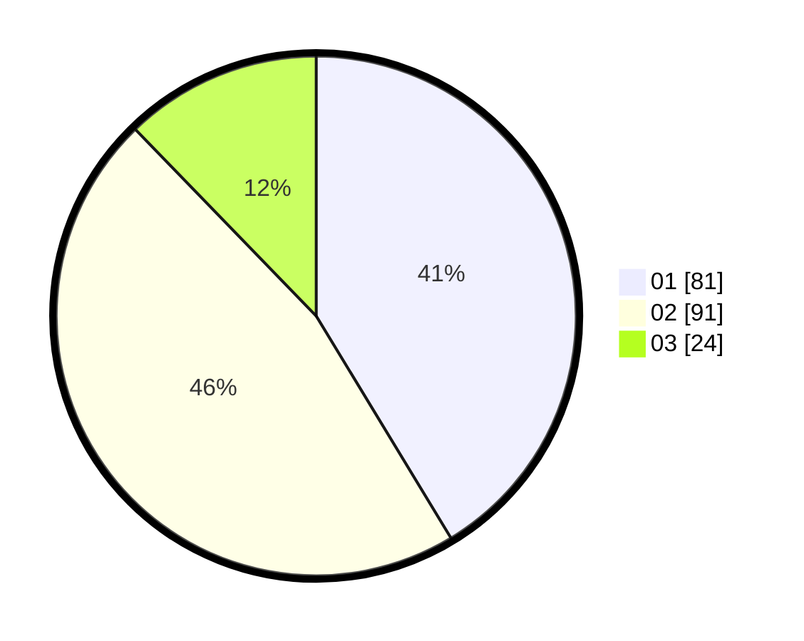

# Hasil

Hasil perolehan suara paslon dapat dilihat pada file paslon-01.txt, paslon-02.txt, dan paslon-03.txt.

Jika tidak ada, artinya data tersebut belum ada pada SIREKAP.

## Perolehan Suara

 * Paslon 01: **81**.
 * Paslon 02: **91**.
 * Paslon 03: **24**.

## Foto C Plano

https://sirekap-obj-formc.kpu.go.id/575d/pemilu/ppwp/31/72/04/10/02/3172041002008-20240214-203159--4033e3a7-8674-41b9-8c8e-eeef7c8a465f.jpg

https://sirekap-obj-formc.kpu.go.id/575d/pemilu/ppwp/31/72/04/10/02/3172041002008-20240214-203041--47bb53c1-8401-4484-b82c-b416ac01b0c7.jpg

https://sirekap-obj-formc.kpu.go.id/575d/pemilu/ppwp/31/72/04/10/02/3172041002008-20240214-203231--66f83ac7-7e69-4542-b204-23d8ab34cbca.jpg

## DATA PEMILIH TETAP

Jumlah pemilih dalam DPT: **288**.
 * L: **139**.
 * P: **149**.

## DATA PENGGUNA HAK PILIH

Jumlah pengguna hak pilih dalam DPT: **195**.
 * L: **91**.
 * P: **104**.

Jumlah pengguna hak pilih dalam DPTb: **1**.
 * L: **1**.
 * P: **0**.

Jumlah pengguna hak pilih dalam DPK: **1**.
 * L: **1**.
 * P: **0**.

Jumlah pengguna hak pilih: **197**.
 * L: **93**.
 * P: **104**.

## JUMLAH SUARA SAH DAN TIDAK SAH

JUMLAH SELURUH SUARA SAH: **196**.

JUMLAH SUARA TIDAK SAH: **1**.

JUMLAH SELURUH SUARA SAH DAN SUARA TIDAK SAH: **197**.
