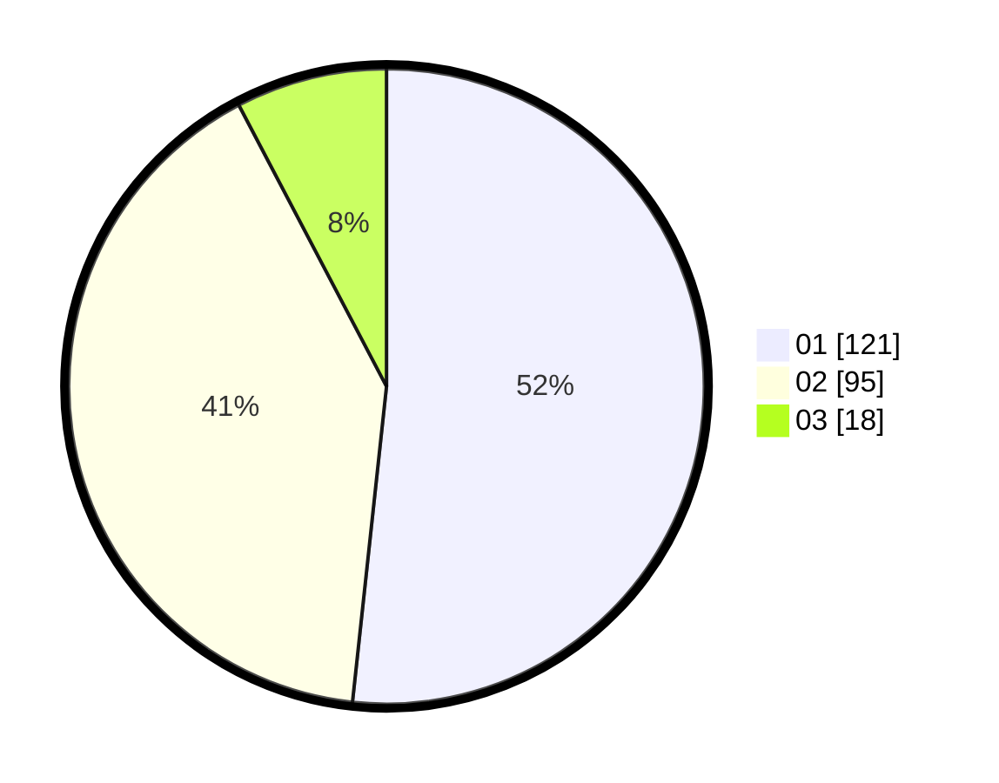

# Hasil

Hasil perolehan suara paslon dapat dilihat pada file paslon-01.txt, paslon-02.txt, dan paslon-03.txt.

Jika tidak ada, artinya data tersebut belum ada pada SIREKAP.

## Perolehan Suara

 * Paslon 01: **121**.
 * Paslon 02: **95**.
 * Paslon 03: **18**.

## Foto C Plano

https://sirekap-obj-formc.kpu.go.id/fe64/pemilu/ppwp/31/72/04/10/02/3172041002013-20240215-053711--519f7f9a-b76c-4015-9bf8-6498d71b4a89.jpg

https://sirekap-obj-formc.kpu.go.id/fe64/pemilu/ppwp/31/72/04/10/02/3172041002013-20240215-053813--a271aa18-08bd-4c2f-8bfb-fe410af886eb.jpg

https://sirekap-obj-formc.kpu.go.id/fe64/pemilu/ppwp/31/72/04/10/02/3172041002013-20240215-053919--76c848b4-7e0d-4415-bbc1-812cad614984.jpg

## DATA PEMILIH TETAP

Jumlah pemilih dalam DPT: **288**.
 * L: **150**.
 * P: **138**.

## DATA PENGGUNA HAK PILIH

Jumlah pengguna hak pilih dalam DPT: **232**.
 * L: **110**.
 * P: **122**.

Jumlah pengguna hak pilih dalam DPTb: **4**.
 * L: **1**.
 * P: **3**.

Jumlah pengguna hak pilih dalam DPK: **3**.
 * L: **2**.
 * P: **1**.

Jumlah pengguna hak pilih: **239**.
 * L: **113**.
 * P: **126**.

## JUMLAH SUARA SAH DAN TIDAK SAH

JUMLAH SELURUH SUARA SAH: **235**.

JUMLAH SUARA TIDAK SAH: **4**.

JUMLAH SELURUH SUARA SAH DAN SUARA TIDAK SAH: **239**.
