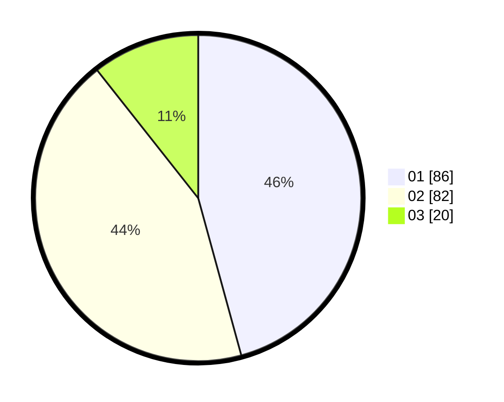

# Hasil

Hasil perolehan suara paslon dapat dilihat pada file paslon-01.txt, paslon-02.txt, dan paslon-03.txt.

Jika tidak ada, artinya data tersebut belum ada pada SIREKAP.

## Perolehan Suara

 * Paslon 01: **86**.
 * Paslon 02: **82**.
 * Paslon 03: **20**.

## Foto C Plano

https://sirekap-obj-formc.kpu.go.id/f429/pemilu/ppwp/31/72/04/10/02/3172041002027-20240215-025549--0312f321-3c1f-4135-83f8-fe1aaf2569c7.jpg

https://sirekap-obj-formc.kpu.go.id/f429/pemilu/ppwp/31/72/04/10/02/3172041002027-20240214-185146--d8dc70fc-db98-49bc-8e35-0d1982a206a5.jpg

https://sirekap-obj-formc.kpu.go.id/f429/pemilu/ppwp/31/72/04/10/02/3172041002027-20240214-185156--e8d6db81-29ed-4b6a-8a9f-5d9ff0781cd9.jpg

## DATA PEMILIH TETAP

Jumlah pemilih dalam DPT: **289**.
 * L: **147**.
 * P: **142**.

## DATA PENGGUNA HAK PILIH

Jumlah pengguna hak pilih dalam DPT: **191**.
 * L: **98**.
 * P: **93**.

Jumlah pengguna hak pilih dalam DPTb: **1**.
 * L: **1**.
 * P: **0**.

Jumlah pengguna hak pilih dalam DPK: **0**.
 * L: **0**.
 * P: **0**.

Jumlah pengguna hak pilih: **192**.
 * L: **99**.
 * P: **93**.

## JUMLAH SUARA SAH DAN TIDAK SAH

JUMLAH SELURUH SUARA SAH: **188**.

JUMLAH SUARA TIDAK SAH: **4**.

JUMLAH SELURUH SUARA SAH DAN SUARA TIDAK SAH: **192**.
