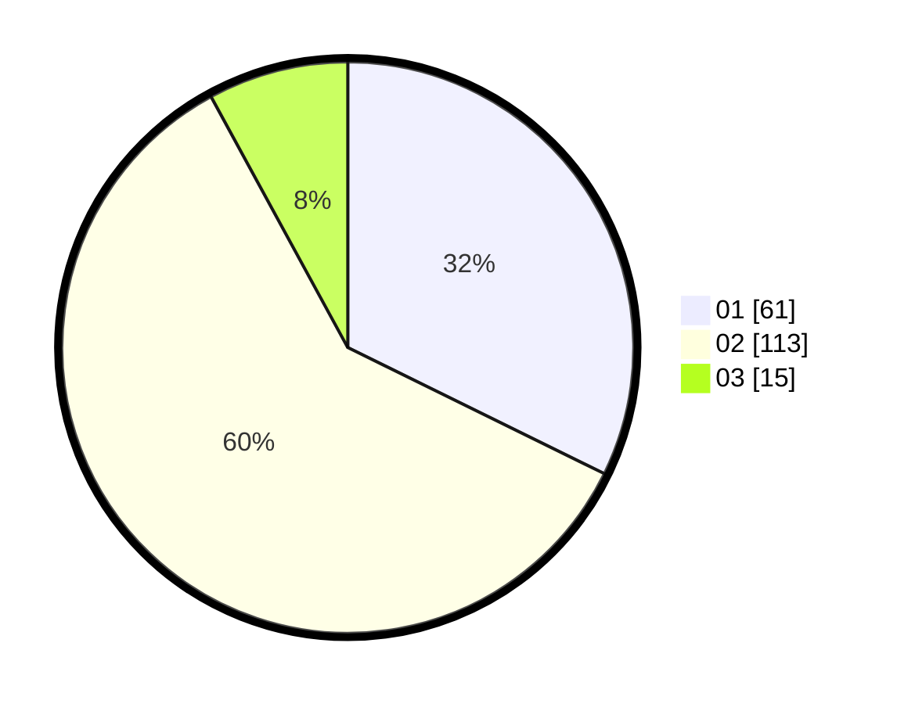

# Hasil

Hasil perolehan suara paslon dapat dilihat pada file paslon-01.txt, paslon-02.txt, dan paslon-03.txt.

Jika tidak ada, artinya data tersebut belum ada pada SIREKAP.

## Perolehan Suara

 * Paslon 01: **61**.
 * Paslon 02: **113**.
 * Paslon 03: **15**.

## Foto C Plano

https://sirekap-obj-formc.kpu.go.id/96ba/pemilu/ppwp/31/72/04/10/02/3172041002036-20240215-032017--403a5101-1670-4242-b202-92f9e84567c8.jpg

https://sirekap-obj-formc.kpu.go.id/96ba/pemilu/ppwp/31/72/04/10/02/3172041002036-20240215-032128--599b9755-897d-413f-b5b0-e63a73b10b07.jpg

https://sirekap-obj-formc.kpu.go.id/96ba/pemilu/ppwp/31/72/04/10/02/3172041002036-20240215-032212--2d92e7eb-cdc8-4976-86c4-71bb60c9df33.jpg

## DATA PEMILIH TETAP

Jumlah pemilih dalam DPT: **288**.
 * L: **134**.
 * P: **154**.

## DATA PENGGUNA HAK PILIH

Jumlah pengguna hak pilih dalam DPT: **191**.
 * L: **80**.
 * P: **111**.

Jumlah pengguna hak pilih dalam DPTb: **0**.
 * L: **0**.
 * P: **0**.

Jumlah pengguna hak pilih dalam DPK: **2**.
 * L: **1**.
 * P: **1**.

Jumlah pengguna hak pilih: **193**.
 * L: **81**.
 * P: **112**.

## JUMLAH SUARA SAH DAN TIDAK SAH
