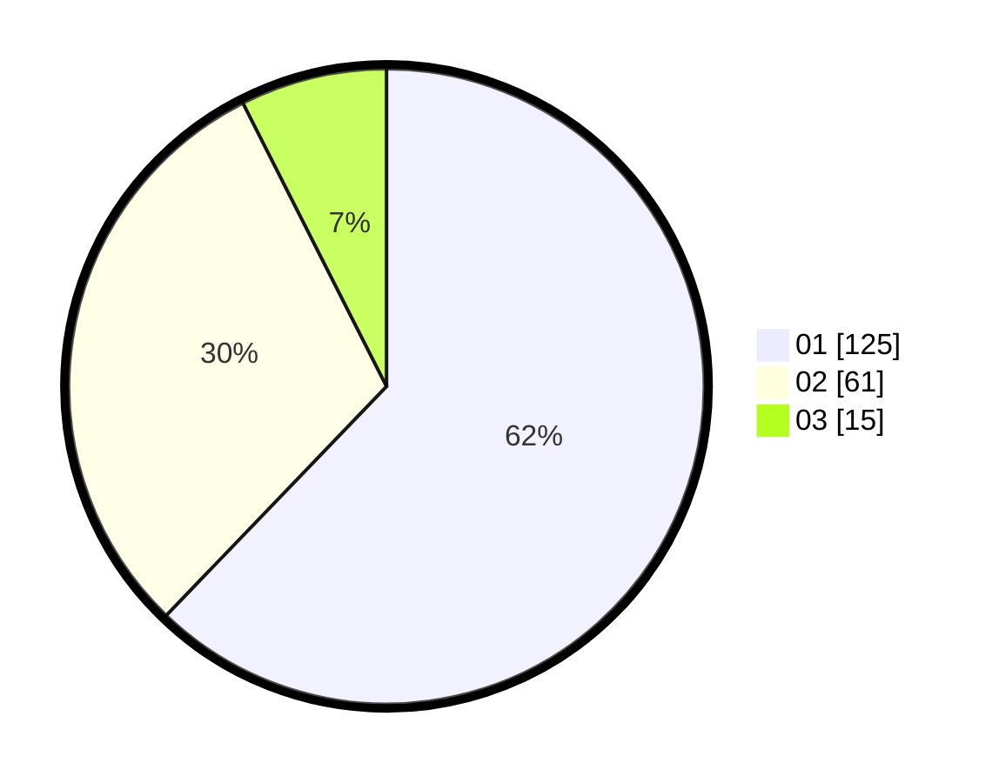

# Hasil

Hasil perolehan suara paslon dapat dilihat pada file paslon-01.txt, paslon-02.txt, dan paslon-03.txt.

Jika tidak ada, artinya data tersebut belum ada pada SIREKAP.

## Perolehan Suara

 * Paslon 01: **125**.
 * Paslon 02: **61**.
 * Paslon 03: **15**.

## Foto C Plano

https://sirekap-obj-formc.kpu.go.id/874e/pemilu/ppwp/31/72/04/10/02/3172041002058-20240214-204749--6a1c0768-4f2d-4bfa-b28e-eba4e79eebf1.jpg

https://sirekap-obj-formc.kpu.go.id/874e/pemilu/ppwp/31/72/04/10/02/3172041002058-20240214-214657--237db866-ee78-4a78-9f70-ba4e00d2e86c.jpg

https://sirekap-obj-formc.kpu.go.id/874e/pemilu/ppwp/31/72/04/10/02/3172041002058-20240214-215640--2baf6743-ab98-4c9a-885a-bd7e38d44c5a.jpg

## DATA PEMILIH TETAP

Jumlah pemilih dalam DPT: **284**.
 * L: **152**.
 * P: **132**.

## DATA PENGGUNA HAK PILIH

Jumlah pengguna hak pilih dalam DPT: **204**.
 * L: **101**.
 * P: **103**.

Jumlah pengguna hak pilih dalam DPTb: **1**.
 * L: **1**.
 * P: **0**.

Jumlah pengguna hak pilih dalam DPK: **0**.
 * L: **0**.
 * P: **0**.

Jumlah pengguna hak pilih: **205**.
 * L: **102**.
 * P: **103**.

## JUMLAH SUARA SAH DAN TIDAK SAH

JUMLAH SELURUH SUARA SAH: **255**.

JUMLAH SUARA TIDAK SAH: **4**.

JUMLAH SELURUH SUARA SAH DAN SUARA TIDAK SAH: **205**.
