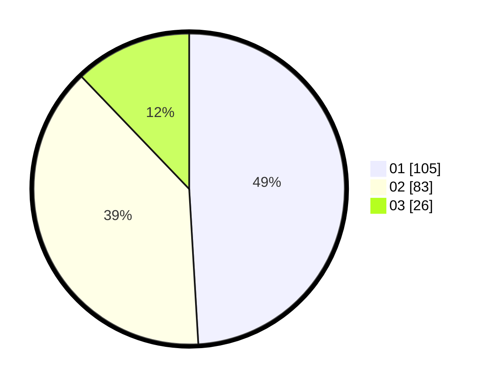

# Hasil

Hasil perolehan suara paslon dapat dilihat pada file paslon-01.txt, paslon-02.txt, dan paslon-03.txt.

Jika tidak ada, artinya data tersebut belum ada pada SIREKAP.

## Perolehan Suara

 * Paslon 01: **105**.
 * Paslon 02: **83**.
 * Paslon 03: **26**.

## Foto C Plano

https://sirekap-obj-formc.kpu.go.id/cd11/pemilu/ppwp/31/72/04/10/02/3172041002074-20240215-001329--29019626-7489-4957-814e-bd38b77f1baa.jpg

https://sirekap-obj-formc.kpu.go.id/cd11/pemilu/ppwp/31/72/04/10/02/3172041002074-20240215-001446--ee0e34a0-5106-4921-a9ae-fc4613c6ea21.jpg

https://sirekap-obj-formc.kpu.go.id/cd11/pemilu/ppwp/31/72/04/10/02/3172041002074-20240215-001513--74940dea-0750-4f55-9e33-a11e27cfcf79.jpg

## DATA PEMILIH TETAP

Jumlah pemilih dalam DPT: **290**.
 * L: **145**.
 * P: **145**.

## DATA PENGGUNA HAK PILIH

Jumlah pengguna hak pilih dalam DPT: **216**.
 * L: **102**.
 * P: **114**.

Jumlah pengguna hak pilih dalam DPTb: **1**.
 * L: **0**.
 * P: **1**.

Jumlah pengguna hak pilih dalam DPK: **0**.
 * L: **0**.
 * P: **0**.

Jumlah pengguna hak pilih: **217**.
 * L: **102**.
 * P: **115**.

## JUMLAH SUARA SAH DAN TIDAK SAH

JUMLAH SELURUH SUARA SAH: **214**.

JUMLAH SUARA TIDAK SAH: **3**.

JUMLAH SELURUH SUARA SAH DAN SUARA TIDAK SAH: **217**.
