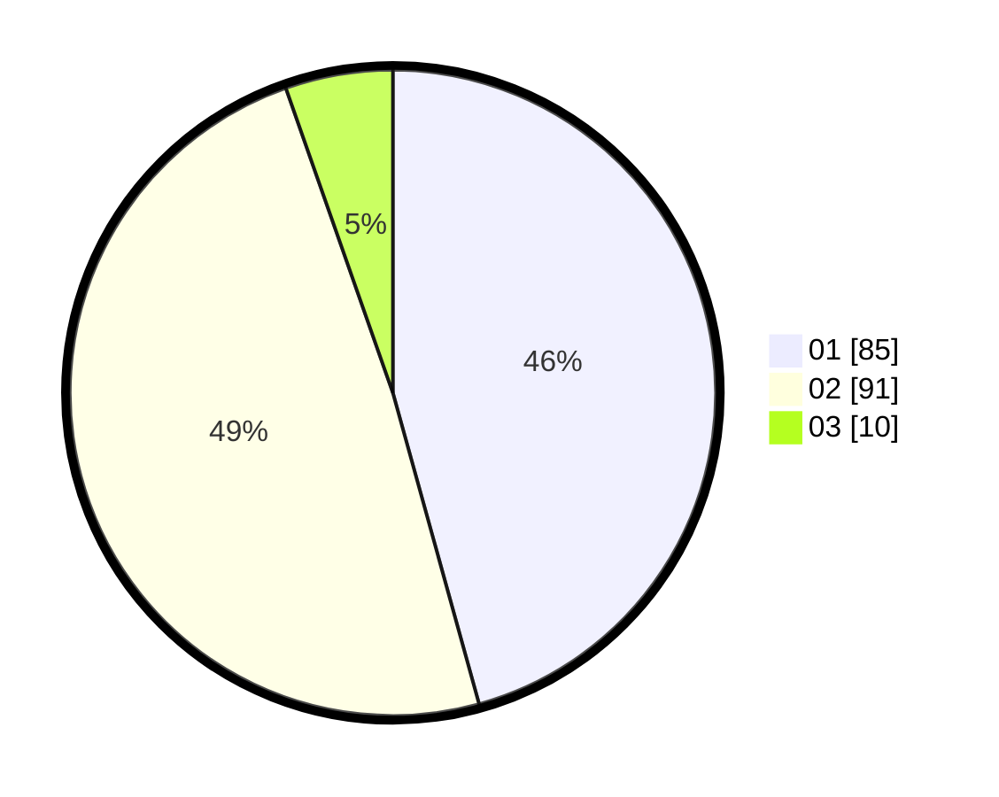

# Hasil

Hasil perolehan suara paslon dapat dilihat pada file paslon-01.txt, paslon-02.txt, dan paslon-03.txt.

Jika tidak ada, artinya data tersebut belum ada pada SIREKAP.

## Perolehan Suara

 * Paslon 01: **85**.
 * Paslon 02: **91**.
 * Paslon 03: **10**.

## Foto C Plano

https://sirekap-obj-formc.kpu.go.id/92e6/pemilu/ppwp/31/72/04/10/02/3172041002075-20240216-170801--1a6ccbd2-fb98-4c7b-9c5f-8d702861f073.jpg

https://sirekap-obj-formc.kpu.go.id/92e6/pemilu/ppwp/31/72/04/10/02/3172041002075-20240216-170819--5b6c4c2f-d55c-4ce3-928f-ba9b1cc292ab.jpg

https://sirekap-obj-formc.kpu.go.id/92e6/pemilu/ppwp/31/72/04/10/02/3172041002075-20240216-170835--9ff4332b-77b0-4e95-8137-a13f45e3ce77.jpg

## DATA PEMILIH TETAP

Jumlah pemilih dalam DPT: **261**.
 * L: **125**.
 * P: **136**.

## DATA PENGGUNA HAK PILIH

Jumlah pengguna hak pilih dalam DPT: **182**.
 * L: **83**.
 * P: **99**.

Jumlah pengguna hak pilih dalam DPTb: **1**.
 * L: **1**.
 * P: **0**.

Jumlah pengguna hak pilih dalam DPK: **7**.
 * L: **4**.
 * P: **3**.

Jumlah pengguna hak pilih: **190**.
 * L: **88**.
 * P: **102**.

## JUMLAH SUARA SAH DAN TIDAK SAH

JUMLAH SELURUH SUARA SAH: **186**.

JUMLAH SUARA TIDAK SAH: **4**.

JUMLAH SELURUH SUARA SAH DAN SUARA TIDAK SAH: **190**.
