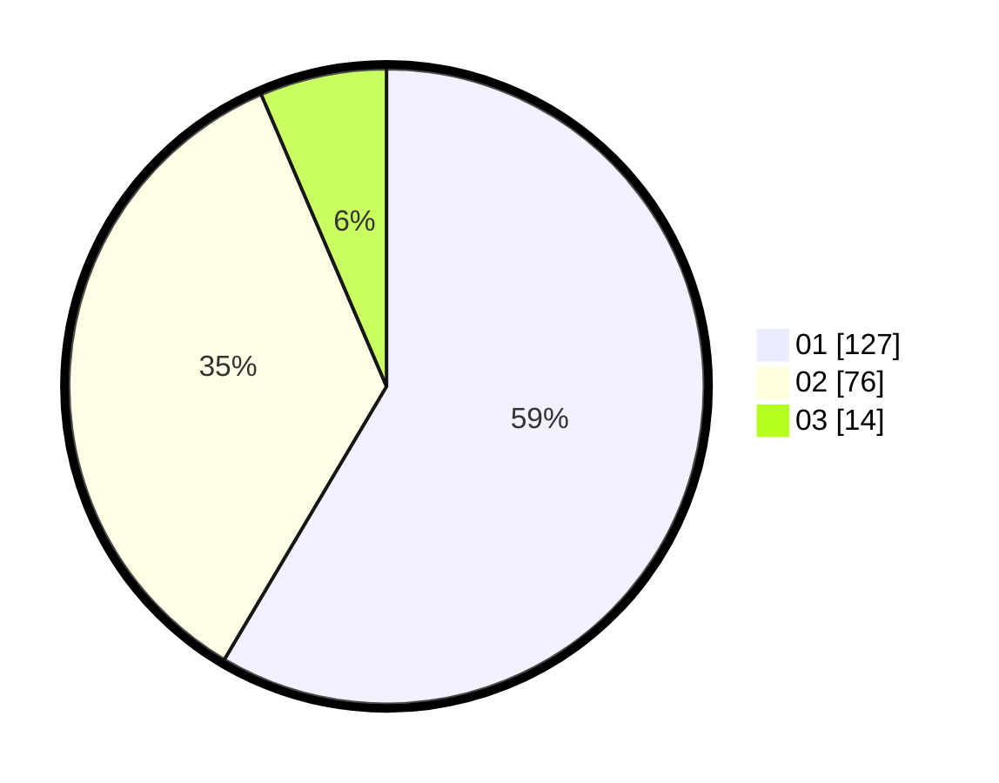

# Hasil

Hasil perolehan suara paslon dapat dilihat pada file paslon-01.txt, paslon-02.txt, dan paslon-03.txt.

Jika tidak ada, artinya data tersebut belum ada pada SIREKAP.

## Perolehan Suara

 * Paslon 01: **127**.
 * Paslon 02: **76**.
 * Paslon 03: **14**.

## Foto C Plano

https://sirekap-obj-formc.kpu.go.id/0a51/pemilu/ppwp/31/72/04/10/02/3172041002080-20240216-194135--c60fbf9a-a2ae-4a7b-9cd5-75f5961ce6c1.jpg

https://sirekap-obj-formc.kpu.go.id/0a51/pemilu/ppwp/31/72/04/10/02/3172041002080-20240214-193752--a5a2a2cd-0973-4afe-80f4-caf9d327ddf0.jpg

https://sirekap-obj-formc.kpu.go.id/0a51/pemilu/ppwp/31/72/04/10/02/3172041002080-20240214-193802--11228921-5dc6-4743-94e4-8973ae97e77d.jpg

## DATA PEMILIH TETAP

Jumlah pemilih dalam DPT: **299**.
 * L: **145**.
 * P: **154**.

## DATA PENGGUNA HAK PILIH

Jumlah pengguna hak pilih dalam DPT: **222**.
 * L: **111**.
 * P: **111**.

Jumlah pengguna hak pilih dalam DPTb: **0**.
 * L: **0**.
 * P: **0**.

Jumlah pengguna hak pilih dalam DPK: **1**.
 * L: **0**.
 * P: **1**.

Jumlah pengguna hak pilih: **223**.
 * L: **111**.
 * P: **112**.

## JUMLAH SUARA SAH DAN TIDAK SAH

JUMLAH SELURUH SUARA SAH: **217**.

JUMLAH SUARA TIDAK SAH: **6**.

JUMLAH SELURUH SUARA SAH DAN SUARA TIDAK SAH: **223**.
