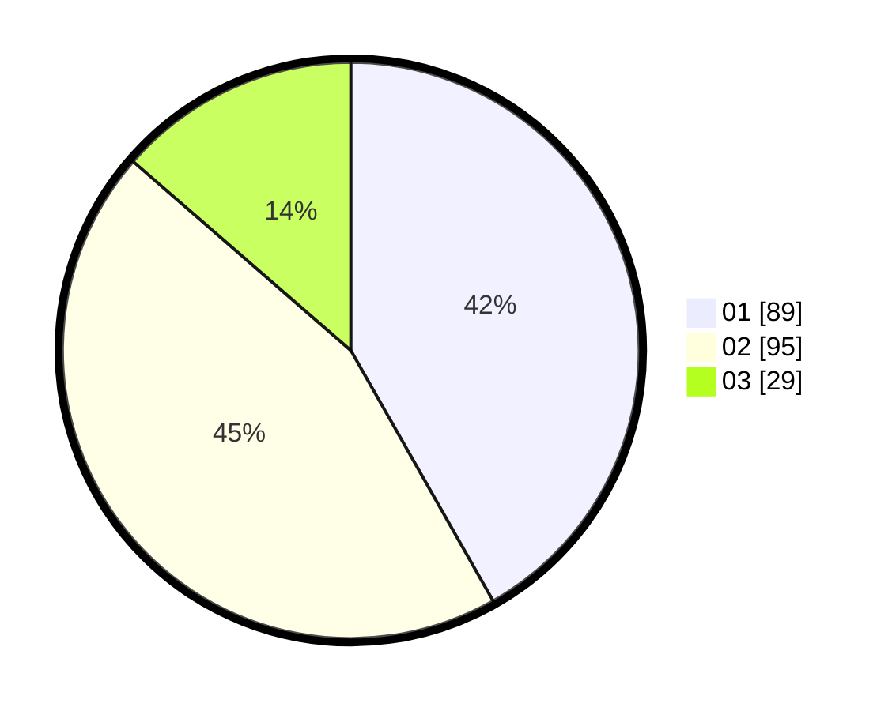

# Hasil

Hasil perolehan suara paslon dapat dilihat pada file paslon-01.txt, paslon-02.txt, dan paslon-03.txt.

Jika tidak ada, artinya data tersebut belum ada pada SIREKAP.

## Perolehan Suara

 * Paslon 01: **89**.
 * Paslon 02: **95**.
 * Paslon 03: **29**.

## Foto C Plano

https://sirekap-obj-formc.kpu.go.id/85ee/pemilu/ppwp/31/72/04/10/02/3172041002088-20240215-145043--ff9388f2-a4e4-49e3-9bdd-330f4380e289.jpg

https://sirekap-obj-formc.kpu.go.id/85ee/pemilu/ppwp/31/72/04/10/02/3172041002088-20240215-145114--c4f96fe4-fac8-40f3-a7af-cbaad02fdaa0.jpg

https://sirekap-obj-formc.kpu.go.id/85ee/pemilu/ppwp/31/72/04/10/02/3172041002088-20240215-145132--1959869a-7af7-4aa2-84b1-99ce5631bca3.jpg

## DATA PEMILIH TETAP

Jumlah pemilih dalam DPT: **286**.
 * L: **135**.
 * P: **151**.

## DATA PENGGUNA HAK PILIH

Jumlah pengguna hak pilih dalam DPT: **206**.
 * L: **95**.
 * P: **111**.

Jumlah pengguna hak pilih dalam DPTb: **2**.
 * L: **0**.
 * P: **2**.

Jumlah pengguna hak pilih dalam DPK: **6**.
 * L: **4**.
 * P: **2**.

Jumlah pengguna hak pilih: **214**.
 * L: **99**.
 * P: **115**.

## JUMLAH SUARA SAH DAN TIDAK SAH

JUMLAH SELURUH SUARA SAH: **213**.

JUMLAH SUARA TIDAK SAH: **1**.

JUMLAH SELURUH SUARA SAH DAN SUARA TIDAK SAH: **214**.
