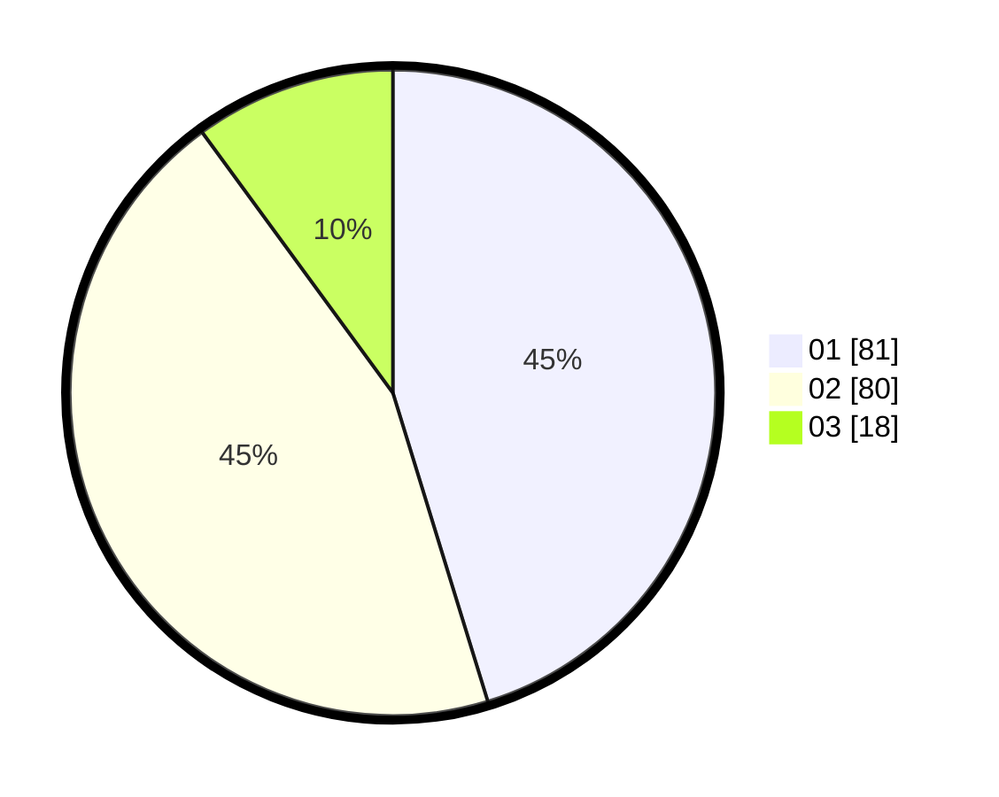

# Hasil

Hasil perolehan suara paslon dapat dilihat pada file paslon-01.txt, paslon-02.txt, dan paslon-03.txt.

Jika tidak ada, artinya data tersebut belum ada pada SIREKAP.

## Perolehan Suara

 * Paslon 01: **81**.
 * Paslon 02: **80**.
 * Paslon 03: **18**.

## Foto C Plano

https://sirekap-obj-formc.kpu.go.id/eb79/pemilu/ppwp/31/72/04/10/02/3172041002091-20240217-000412--1ea5b12c-faa5-48c2-9f3e-bf7e075163da.jpg

https://sirekap-obj-formc.kpu.go.id/eb79/pemilu/ppwp/31/72/04/10/02/3172041002091-20240217-000502--8d1fbb88-0826-4833-a97e-0b0725a09fde.jpg

https://sirekap-obj-formc.kpu.go.id/eb79/pemilu/ppwp/31/72/04/10/02/3172041002091-20240217-000605--6cb5cf41-a6eb-4c4d-86f9-4388a622918b.jpg

## DATA PEMILIH TETAP

Jumlah pemilih dalam DPT: **285**.
 * L: **148**.
 * P: **137**.

## DATA PENGGUNA HAK PILIH

Jumlah pengguna hak pilih dalam DPT: **177**.
 * L: **86**.
 * P: **91**.

Jumlah pengguna hak pilih dalam DPTb: **0**.
 * L: **0**.
 * P: **0**.

Jumlah pengguna hak pilih dalam DPK: **5**.
 * L: **3**.
 * P: **2**.

Jumlah pengguna hak pilih: **182**.
 * L: **89**.
 * P: **93**.

## JUMLAH SUARA SAH DAN TIDAK SAH

JUMLAH SELURUH SUARA SAH: **179**.

JUMLAH SUARA TIDAK SAH: **3**.

JUMLAH SELURUH SUARA SAH DAN SUARA TIDAK SAH: **182**.
