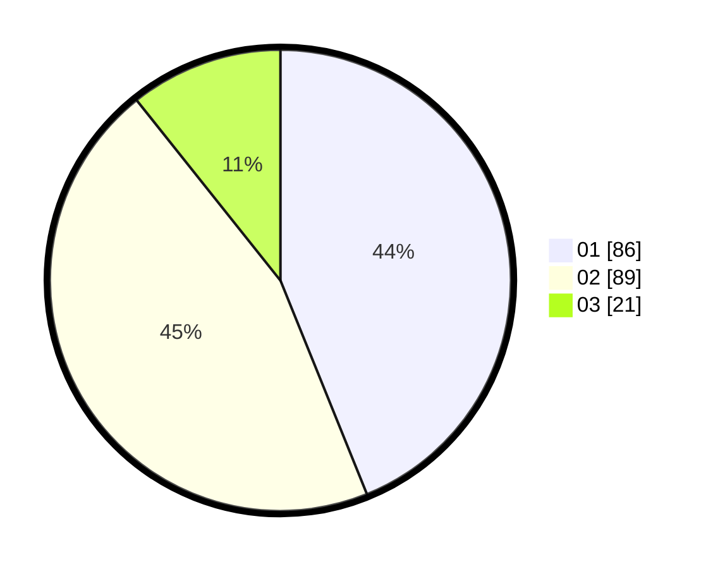

# Hasil

Hasil perolehan suara paslon dapat dilihat pada file paslon-01.txt, paslon-02.txt, dan paslon-03.txt.

Jika tidak ada, artinya data tersebut belum ada pada SIREKAP.

## Perolehan Suara

 * Paslon 01: **86**.
 * Paslon 02: **89**.
 * Paslon 03: **21**.

## Foto C Plano

https://sirekap-obj-formc.kpu.go.id/c186/pemilu/ppwp/31/72/04/10/02/3172041002094-20240216-120508--7dff1d4f-0650-440b-8575-fc1e06e206af.jpg

https://sirekap-obj-formc.kpu.go.id/c186/pemilu/ppwp/31/72/04/10/02/3172041002094-20240216-123045--850dee50-a7a6-45bd-8a83-089469100feb.jpg

https://sirekap-obj-formc.kpu.go.id/c186/pemilu/ppwp/31/72/04/10/02/3172041002094-20240216-115517--215f10e3-a860-483f-987d-53219416fb26.jpg

## DATA PEMILIH TETAP

Jumlah pemilih dalam DPT: **197**.
 * L: **86**.
 * P: **111**.

## DATA PENGGUNA HAK PILIH

Jumlah pengguna hak pilih dalam DPT: **195**.
 * L: **85**.
 * P: **110**.

Jumlah pengguna hak pilih dalam DPTb: **1**.
 * L: **0**.
 * P: **1**.

Jumlah pengguna hak pilih dalam DPK: **1**.
 * L: **1**.
 * P: **0**.

Jumlah pengguna hak pilih: **197**.
 * L: **86**.
 * P: **111**.

## JUMLAH SUARA SAH DAN TIDAK SAH

JUMLAH SELURUH SUARA SAH: **196**.

JUMLAH SUARA TIDAK SAH: **1**.

JUMLAH SELURUH SUARA SAH DAN SUARA TIDAK SAH: **197**.
