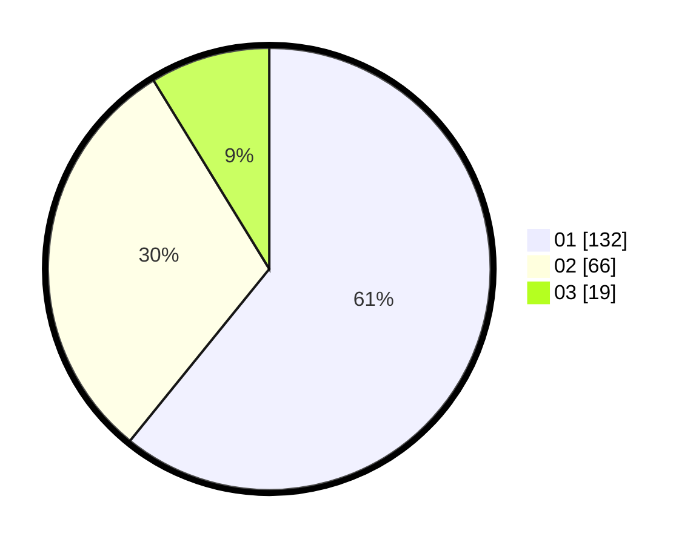

# Hasil

Hasil perolehan suara paslon dapat dilihat pada file paslon-01.txt, paslon-02.txt, dan paslon-03.txt.

Jika tidak ada, artinya data tersebut belum ada pada SIREKAP.

## Perolehan Suara

 * Paslon 01: **132**.
 * Paslon 02: **66**.
 * Paslon 03: **19**.

## Foto C Plano

https://sirekap-obj-formc.kpu.go.id/f76c/pemilu/ppwp/31/72/04/10/02/3172041002098-20240215-222346--12e226ad-e256-4197-90cb-01b4d163a0e7.jpg

https://sirekap-obj-formc.kpu.go.id/f76c/pemilu/ppwp/31/72/04/10/02/3172041002098-20240215-222347--251be792-c723-40e6-8b12-e06713699602.jpg

https://sirekap-obj-formc.kpu.go.id/f76c/pemilu/ppwp/31/72/04/10/02/3172041002098-20240215-222346--5a5e1ab2-0ef1-4d3d-81c1-f8e54046b734.jpg

## DATA PEMILIH TETAP

Jumlah pemilih dalam DPT: **287**.
 * L: **141**.
 * P: **146**.

## DATA PENGGUNA HAK PILIH

Jumlah pengguna hak pilih dalam DPT: **214**.
 * L: **94**.
 * P: **120**.

Jumlah pengguna hak pilih dalam DPTb: **0**.
 * L: **0**.
 * P: **0**.

Jumlah pengguna hak pilih dalam DPK: **4**.
 * L: **2**.
 * P: **2**.

Jumlah pengguna hak pilih: **218**.
 * L: **96**.
 * P: **122**.

## JUMLAH SUARA SAH DAN TIDAK SAH

JUMLAH SELURUH SUARA SAH: **217**.

JUMLAH SUARA TIDAK SAH: **1**.

JUMLAH SELURUH SUARA SAH DAN SUARA TIDAK SAH: **218**.
