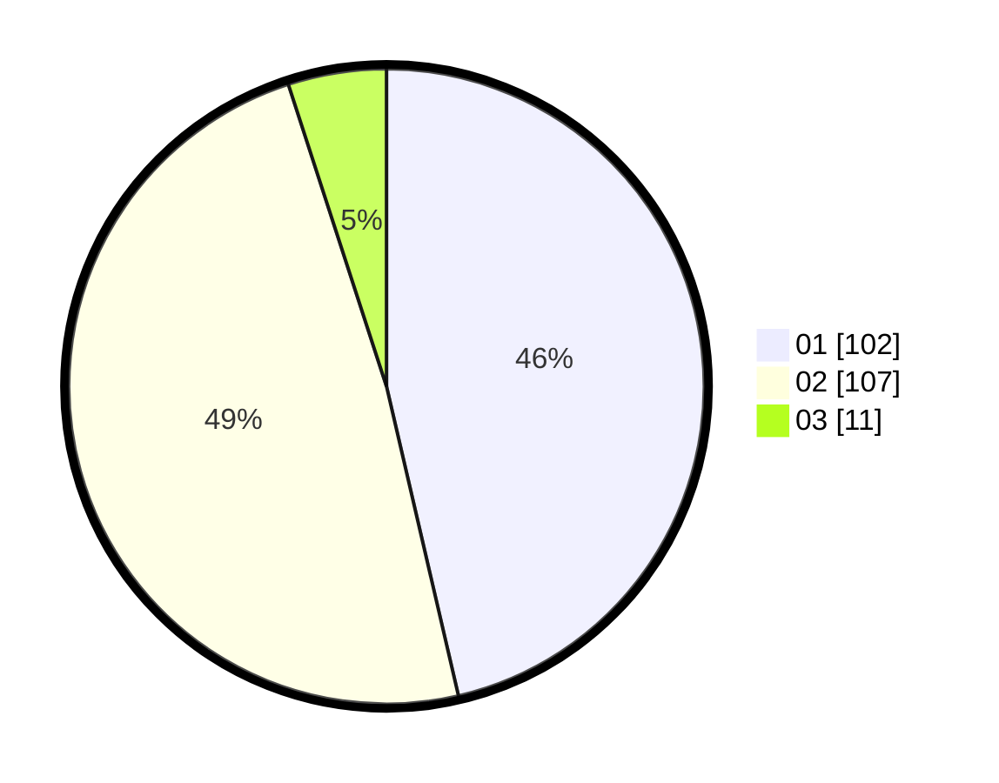

# Hasil

Hasil perolehan suara paslon dapat dilihat pada file paslon-01.txt, paslon-02.txt, dan paslon-03.txt.

Jika tidak ada, artinya data tersebut belum ada pada SIREKAP.

## Perolehan Suara

 * Paslon 01: **102**.
 * Paslon 02: **107**.
 * Paslon 03: **11**.

## Foto C Plano

https://sirekap-obj-formc.kpu.go.id/8a9c/pemilu/ppwp/31/72/04/10/02/3172041002099-20240215-064636--376497a8-49ea-4193-8d29-19941bc887ba.jpg

https://sirekap-obj-formc.kpu.go.id/8a9c/pemilu/ppwp/31/72/04/10/02/3172041002099-20240215-064647--831f4a45-6dc3-4ec1-8da9-4bdcb3b67f13.jpg

https://sirekap-obj-formc.kpu.go.id/8a9c/pemilu/ppwp/31/72/04/10/02/3172041002099-20240215-064654--14009367-36fd-4246-ae29-ad098d5fe4cd.jpg
