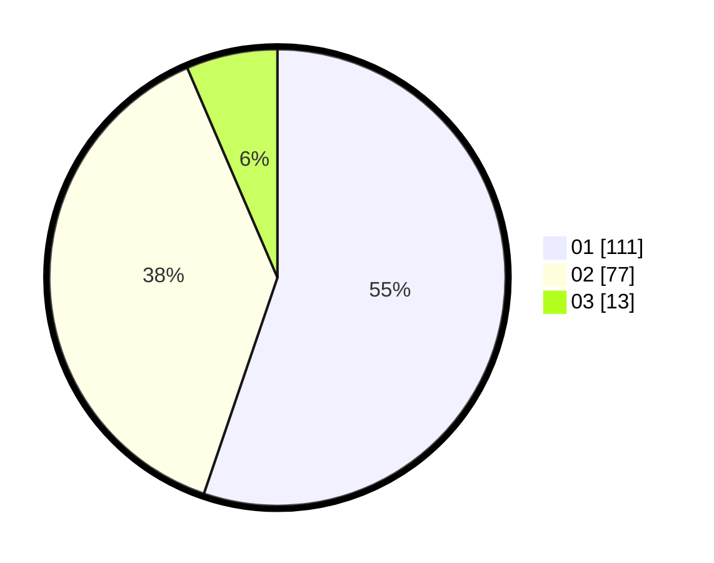

# Hasil

Hasil perolehan suara paslon dapat dilihat pada file paslon-01.txt, paslon-02.txt, dan paslon-03.txt.

Jika tidak ada, artinya data tersebut belum ada pada SIREKAP.

## Perolehan Suara

 * Paslon 01: **111**.
 * Paslon 02: **77**.
 * Paslon 03: **13**.

## Foto C Plano

https://sirekap-obj-formc.kpu.go.id/8ce7/pemilu/ppwp/31/72/04/10/02/3172041002121-20240214-185743--fdcba136-26a6-4f34-87ab-290f73b41169.jpg

https://sirekap-obj-formc.kpu.go.id/8ce7/pemilu/ppwp/31/72/04/10/02/3172041002121-20240214-185800--2e67175e-e0a9-4daa-93a5-15003bff5f0a.jpg

https://sirekap-obj-formc.kpu.go.id/8ce7/pemilu/ppwp/31/72/04/10/02/3172041002121-20240214-185722--e6e0c385-651b-4806-b1e4-e2ba0ee5293a.jpg

## DATA PEMILIH TETAP

Jumlah pemilih dalam DPT: **291**.
 * L: **146**.
 * P: **145**.

## DATA PENGGUNA HAK PILIH

Jumlah pengguna hak pilih dalam DPT: **199**.
 * L: **91**.
 * P: **108**.

Jumlah pengguna hak pilih dalam DPTb: **4**.
 * L: **2**.
 * P: **2**.

Jumlah pengguna hak pilih dalam DPK: **2**.
 * L: **1**.
 * P: **1**.

Jumlah pengguna hak pilih: **205**.
 * L: **94**.
 * P: **111**.

## JUMLAH SUARA SAH DAN TIDAK SAH

JUMLAH SELURUH SUARA SAH: **201**.

JUMLAH SUARA TIDAK SAH: **4**.

JUMLAH SELURUH SUARA SAH DAN SUARA TIDAK SAH: **205**.
