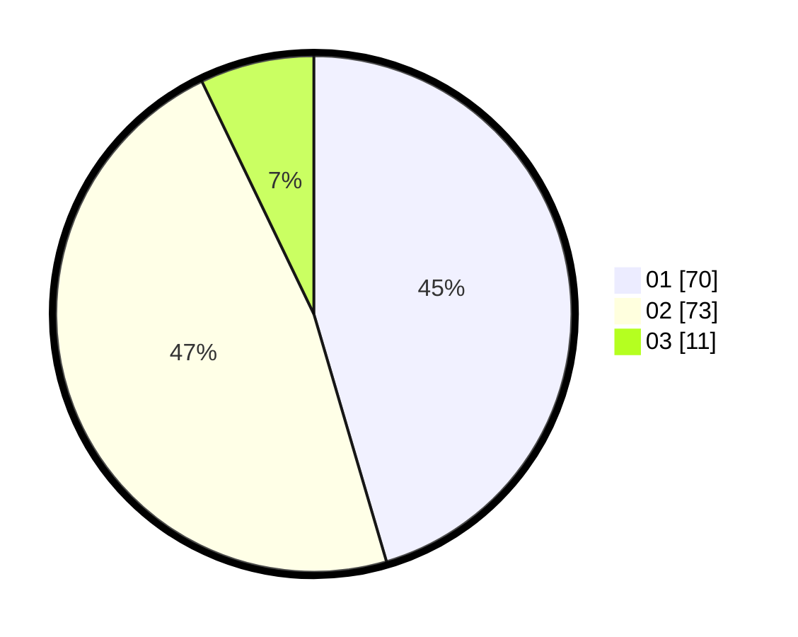

# Hasil

Hasil perolehan suara paslon dapat dilihat pada file paslon-01.txt, paslon-02.txt, dan paslon-03.txt.

Jika tidak ada, artinya data tersebut belum ada pada SIREKAP.

## Perolehan Suara

 * Paslon 01: **70**.
 * Paslon 02: **73**.
 * Paslon 03: **11**.

## Foto C Plano

https://sirekap-obj-formc.kpu.go.id/1a26/pemilu/ppwp/31/72/04/10/02/3172041002128-20240214-221433--09253fb1-0622-4daa-8034-42eedcfc8970.jpg

https://sirekap-obj-formc.kpu.go.id/1a26/pemilu/ppwp/31/72/04/10/02/3172041002128-20240214-221528--df090149-5c71-41e8-9dc8-9c2e132dda54.jpg

https://sirekap-obj-formc.kpu.go.id/1a26/pemilu/ppwp/31/72/04/10/02/3172041002128-20240214-221647--ddcf99b5-69d7-450c-90a3-4895c42f8242.jpg
