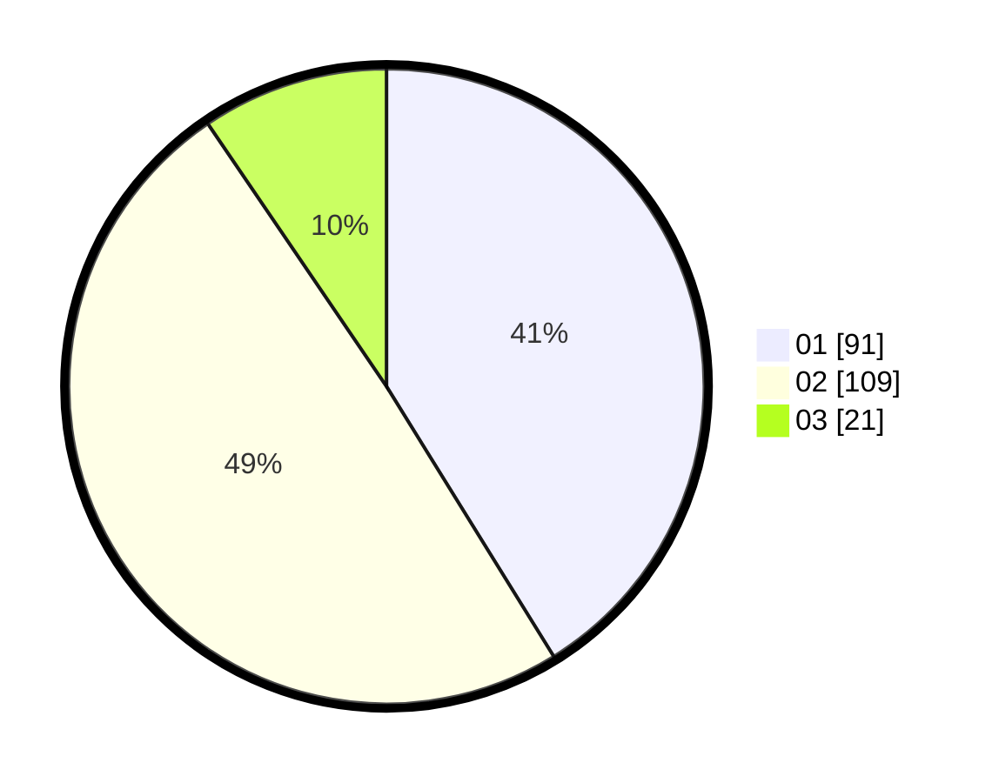

# Hasil

Hasil perolehan suara paslon dapat dilihat pada file paslon-01.txt, paslon-02.txt, dan paslon-03.txt.

Jika tidak ada, artinya data tersebut belum ada pada SIREKAP.

## Perolehan Suara

 * Paslon 01: **91**.
 * Paslon 02: **109**.
 * Paslon 03: **21**.

## Foto C Plano

https://sirekap-obj-formc.kpu.go.id/fcc9/pemilu/ppwp/31/72/04/10/02/3172041002139-20240216-192751--8391bda5-d8d9-4186-8a75-2f7b74d05743.jpg

https://sirekap-obj-formc.kpu.go.id/fcc9/pemilu/ppwp/31/72/04/10/02/3172041002139-20240214-221803--ddf1f712-015c-4791-b9b5-ed315718a4bb.jpg

https://sirekap-obj-formc.kpu.go.id/fcc9/pemilu/ppwp/31/72/04/10/02/3172041002139-20240214-221930--022280de-cb95-4043-a88f-0f38ddd92686.jpg
