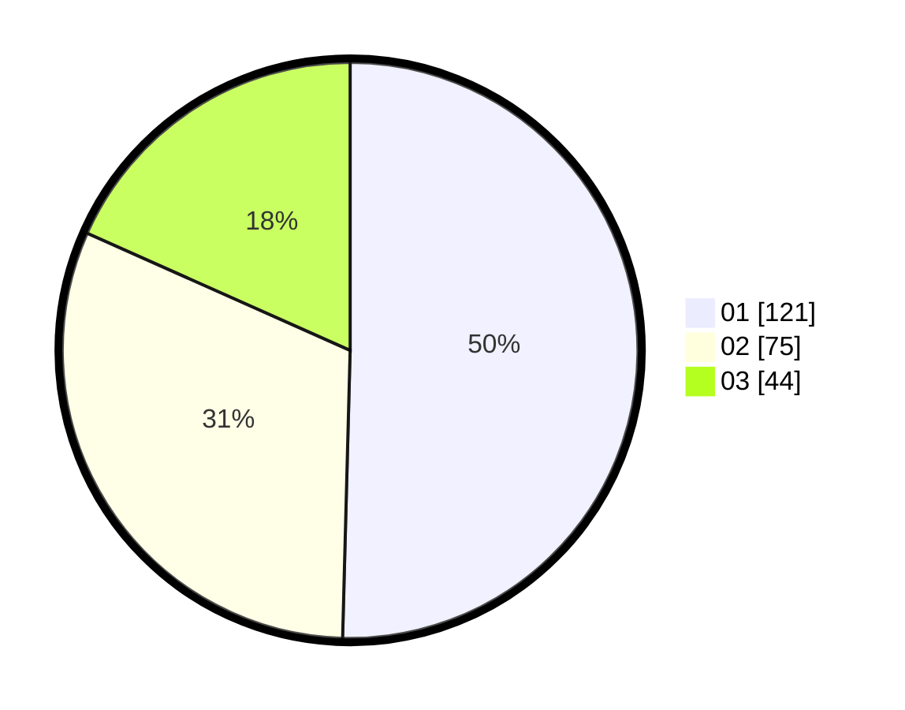

# Hasil

Hasil perolehan suara paslon dapat dilihat pada file paslon-01.txt, paslon-02.txt, dan paslon-03.txt.

Jika tidak ada, artinya data tersebut belum ada pada SIREKAP.

## Perolehan Suara

 * Paslon 01: **121**.
 * Paslon 02: **75**.
 * Paslon 03: **44**.

## Foto C Plano

https://sirekap-obj-formc.kpu.go.id/77b3/pemilu/ppwp/31/72/04/10/02/3172041002143-20240216-143603--62c0c909-b4b7-4ae3-8116-81d18b30e50c.jpg

https://sirekap-obj-formc.kpu.go.id/77b3/pemilu/ppwp/31/72/04/10/02/3172041002143-20240216-143604--55f3e665-ff3d-4a15-9ec1-cf6ce8f2d8db.jpg

https://sirekap-obj-formc.kpu.go.id/77b3/pemilu/ppwp/31/72/04/10/02/3172041002143-20240216-143603--c64a472c-31cf-404b-bfc0-714bcc8fb387.jpg

## DATA PEMILIH TETAP

Jumlah pemilih dalam DPT: **290**.
 * L: **133**.
 * P: **157**.

## DATA PENGGUNA HAK PILIH

Jumlah pengguna hak pilih dalam DPT: **236**.
 * L: **106**.
 * P: **130**.

Jumlah pengguna hak pilih dalam DPTb: **2**.
 * L: **1**.
 * P: **1**.

Jumlah pengguna hak pilih dalam DPK: **4**.
 * L: **2**.
 * P: **2**.

Jumlah pengguna hak pilih: **242**.
 * L: **109**.
 * P: **133**.

## JUMLAH SUARA SAH DAN TIDAK SAH

JUMLAH SELURUH SUARA SAH: **240**.

JUMLAH SUARA TIDAK SAH: **2**.

JUMLAH SELURUH SUARA SAH DAN SUARA TIDAK SAH: **242**.
