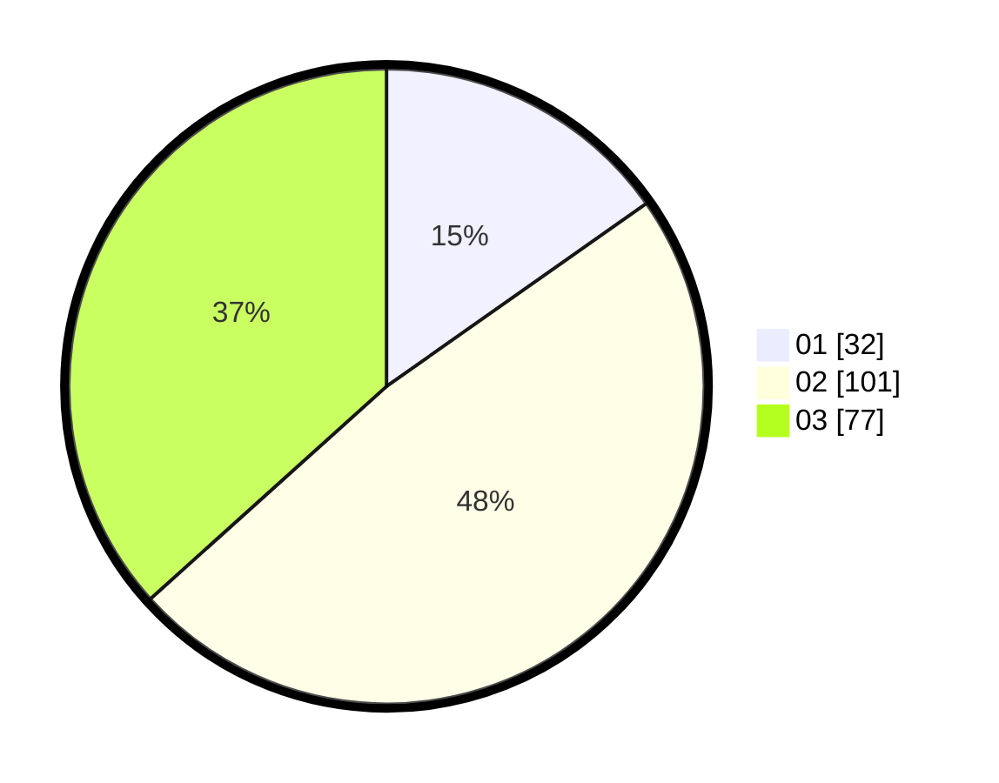

# Hasil

Hasil perolehan suara paslon dapat dilihat pada file paslon-01.txt, paslon-02.txt, dan paslon-03.txt.

Jika tidak ada, artinya data tersebut belum ada pada SIREKAP.

## Perolehan Suara

 * Paslon 01: **32**.
 * Paslon 02: **101**.
 * Paslon 03: **77**.

## Foto C Plano

https://sirekap-obj-formc.kpu.go.id/5bf2/pemilu/ppwp/31/72/04/10/02/3172041002145-20240214-185238--2ea0e79b-17b4-4d35-8607-3af46656f958.jpg

https://sirekap-obj-formc.kpu.go.id/5bf2/pemilu/ppwp/31/72/04/10/02/3172041002145-20240214-185253--df0cad6d-db8b-4c2b-8e83-ab2e0d3dd651.jpg

https://sirekap-obj-formc.kpu.go.id/5bf2/pemilu/ppwp/31/72/04/10/02/3172041002145-20240214-190034--839b1303-943e-4ddd-80e3-b41d2a8e26b1.jpg

## DATA PEMILIH TETAP

Jumlah pemilih dalam DPT: **244**.
 * L: **120**.
 * P: **124**.

## DATA PENGGUNA HAK PILIH

Jumlah pengguna hak pilih dalam DPT: **191**.
 * L: **91**.
 * P: **100**.

Jumlah pengguna hak pilih dalam DPTb: **10**.
 * L: **5**.
 * P: **5**.

Jumlah pengguna hak pilih dalam DPK: **13**.
 * L: **4**.
 * P: **9**.

Jumlah pengguna hak pilih: **214**.
 * L: **100**.
 * P: **114**.

## JUMLAH SUARA SAH DAN TIDAK SAH

JUMLAH SELURUH SUARA SAH: **210**.

JUMLAH SUARA TIDAK SAH: **4**.

JUMLAH SELURUH SUARA SAH DAN SUARA TIDAK SAH: **214**.
